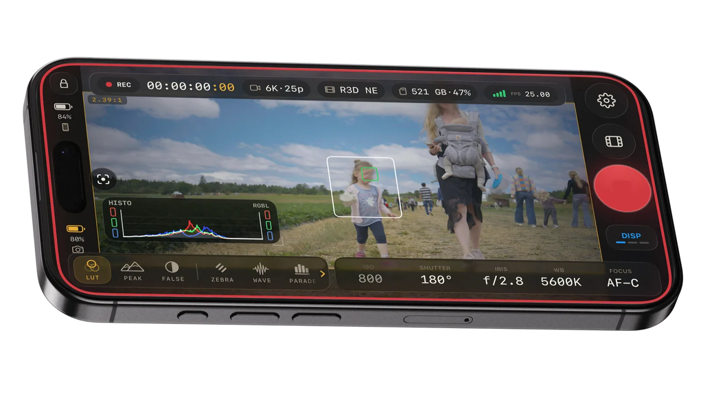
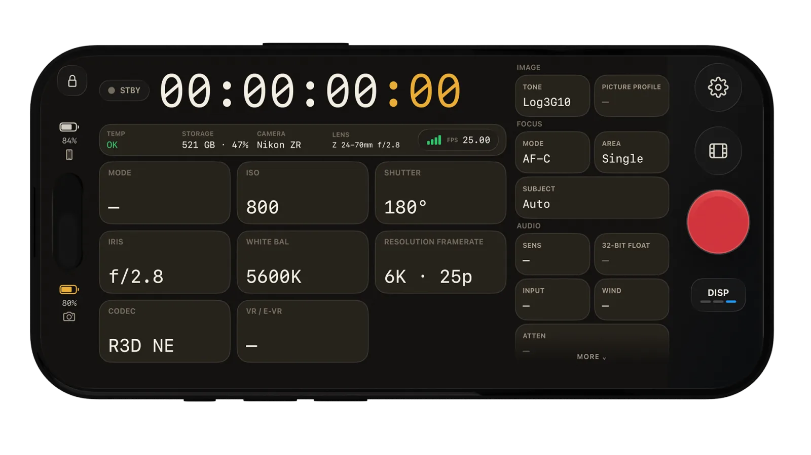
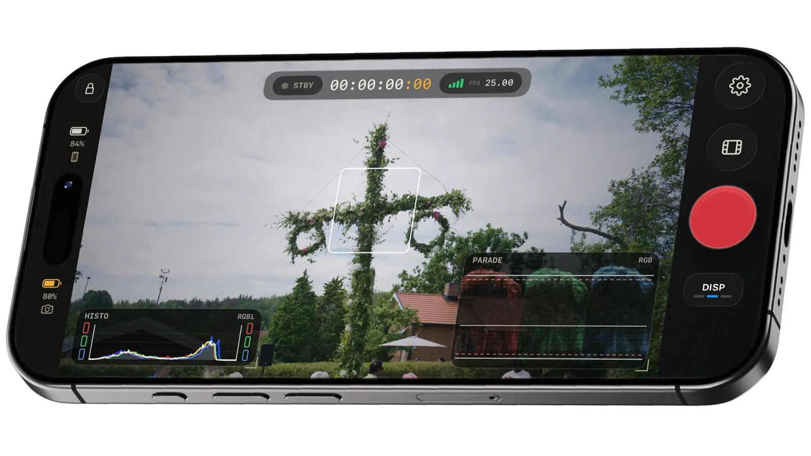
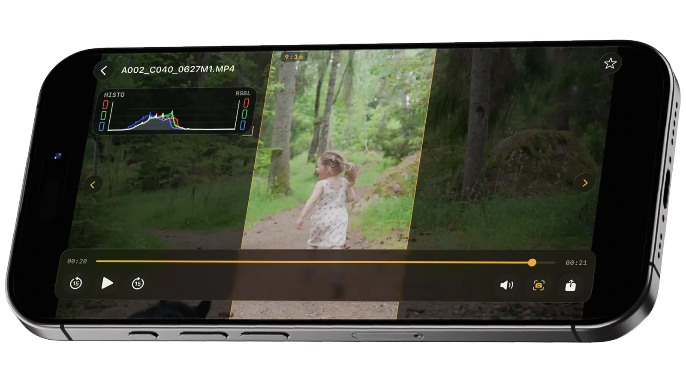
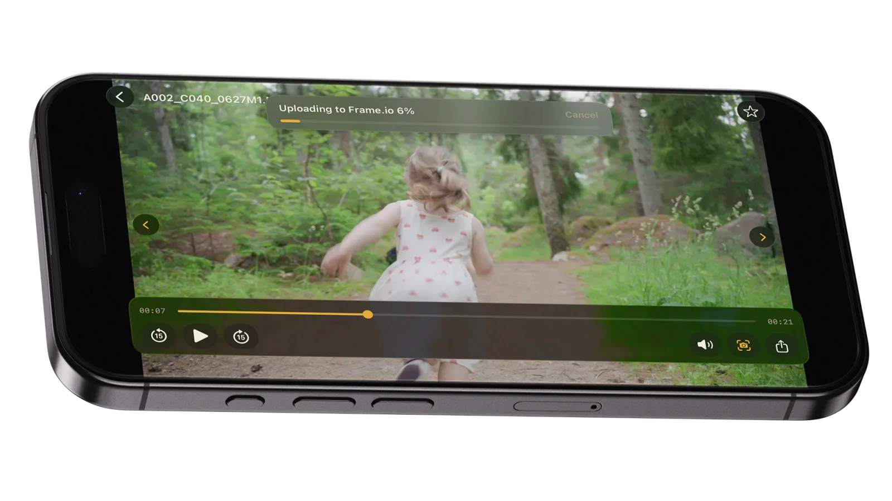

# OpenZCine

[](https://github.com/erik-sutton95/openzcine/actions/workflows/ci.yml)
[](LICENSE)

<p align="center">
  <a href="https://openzcine.app/">
    
  </a>
</p>

<p align="center">
  <strong>The open field monitor for Nikon Z.</strong><br>
  Pro monitoring scopes, playback, full camera control, and Camera-to-Cloud export with LUT
  baking. Free and open source.
</p>

<p align="center">
  <a href="https://testflight.apple.com/join/xu4d6UK8"><strong>Join the TestFlight beta</strong></a>
  &nbsp;·&nbsp;
  <a href="https://openzcine.app/">Visit openzcine.app</a>
  &nbsp;·&nbsp;
  <a href="https://github.com/erik-sutton95/OpenZCine/discussions/22">Explore the roadmap</a>
</p>

## Made for the shot

OpenZCine turns your iPhone or iPad into a production monitor and remote for Nikon Z cinema
cameras, with current development and testing centered on the **Nikon ZR**.

- **Read the image like a colorist.** Waveform, RGB parade, histogram, and vectorscope run live
  beside the image you are judging.
- **Catch exposure and focus before the take.** Codec-aware false color, zebras, RED-inspired
  Traffic Lights, and industry-standard focus peaking work directly on the monitor feed.
- **Frame once for every delivery.** Stack multiple aspect markers, custom frames, grids,
  crosshairs, level, and de-squeeze without losing sight of the shot.
- **Set the camera without touching the camera.** Control ISO, shutter angle, iris, white balance,
  recording format, frame rate, autofocus behavior, and recording from the device on your rig.
- **Review before striking the set.** Browse clips, scrub playback, check scopes and markers, and
  preview the selected look on-device.
- **Ship it with the look baked in.** Apply built-in, RED, or custom `.cube` LUTs during export,
  then send through native iOS sharing or directly to Frame.io.
- **Keep the monitor on your wrist.** The Apple Watch companion mirrors the live feed with its LUT,
  camera status, timecode, and remote record control.

## See it in action

### Live monitoring and camera control

<p align="center">
  <a href="https://openzcine.app/#commander">
    
  </a>
</p>

### Scopes and on-set assists

<p align="center">
  <a href="https://openzcine.app/#scopes">
    
  </a>
</p>

### Playback review and Camera-to-Cloud

<p align="center">
  <a href="https://openzcine.app/#export">
    
  </a>
</p>

<p align="center">
  <a href="https://openzcine.app/#export">
    
  </a>
</p>

## Available in the open beta

- Resilient Wi-Fi discovery, pairing, saved-camera profiles, and automatic reconnect
- Live-view monitoring, timecode, battery, storage, temperature, and camera warning readouts
- Record control plus ISO, shutter, iris, white balance, focus, resolution, frame-rate, and codec
  controls
- Professional scopes, exposure and focus assists, framing tools, and customizable monitor layouts
- On-device clip browsing, playback review, LUT preview, LUT-baked export, and Frame.io delivery
- Adaptive live-view thermal management during long sessions and recording
- Native iPhone and iPad layouts, an Apple Watch companion, and Bluetooth shutter integration
  under hardware validation
- USB-C tethered transport foundation alongside the primary Wi-Fi workflow

OpenZCine is in active beta. Nikon ZR is the primary hardware target today, while USB-C transport,
the Watch companion, and the full iPad experience continue to be hardened with real-world testing.

## Roadmap shaped in the open

The roadmap lives in [GitHub Discussions](https://github.com/erik-sutton95/OpenZCine/discussions/22),
where every proposed feature has its own thread. Browse the
[Ideas category](https://github.com/erik-sutton95/OpenZCine/discussions/categories/ideas) to vote,
add production context, or propose what OpenZCine should tackle next. Roadmap discussions describe
direction, not promised dates or release commitments. Engineering-phase detail lives in
[`docs/ROADMAP.md`](docs/ROADMAP.md).

## Free. Open source. Yours

No subscriptions, no paywalls, no advertising, and no telemetry. OpenZCine is Apache-2.0 licensed
and built in public with Claude Code and Codex so filmmakers and developers can inspect, improve,
and adapt the tool they rely on.

## Architecture

Production targets a shared Swift business/protocol core with native platform shells:

| Layer | Path | Purpose |
| --- | --- | --- |
| **Shared core** | `Sources/OpenZCineCore/` | PTP-IP protocol, camera state, Nikon property codes, discovery, pairing |
| **iOS app** | `ios/` | SwiftUI shell, Bonjour discovery, live-view rendering, camera I/O |
| **Android app** | `Apps/Android/` | Jetpack Compose (future) |
| **Tests** | `Tests/OpenZCineCoreTests/` | Swift package tests — packet encoding, property parsing, discovery, layout |
| **Prototype** | `reference/flutter-prototype/` | Archived Flutter reference — not part of production CI |

The shared Swift core owns all protocol logic and stays portable (no SwiftUI, UIKit, or
Android dependencies). Platform shells own sockets, permissions, lifecycle, rendering, and UI.

See [`docs/design/specs/2026-06-20-production-native-architecture-design.md`](docs/design/specs/2026-06-20-production-native-architecture-design.md)
for the full architecture decision and layering rationale.

### App flows

User journeys and screen-level design live in [`docs/flows/`](docs/flows/) as git-tracked
Excalidraw diagrams (`.excalidraw`, open at [excalidraw.com](https://excalidraw.com) or with an
editor extension) paired with markdown node cards. Conventions: [`docs/flows/README.md`](docs/flows/README.md).

### Built in the open

OpenZCine is deliberately, transparently built with agentic coding tools. Engineering
guidelines live in [`AGENTS.md`](AGENTS.md), design specs and implementation plans in
[`docs/design/`](docs/design/).

OpenZCine went through an extended private R&D phase before publication; the public repository
starts from a clean slate with a squashed initial commit rather than carrying the experimental
history along.

## No vendor SDK

This project is not affiliated with Nikon. No Nikon SDK or proprietary documentation is included
in, distributed with, or required by this project. The camera protocol is implemented from public
sources — see [`docs/nikon-sdk.md`](docs/nikon-sdk.md).

## Development

Tooling is managed through [`just`](https://github.com/casey/just):

```bash
just setup        # install meta-check tools (macOS / Homebrew)
just              # list all recipes
just check        # run repository quality checks
just format       # format Swift sources
just test         # run Swift package tests
just native-check # run Swift tests and build the native iOS app
```

## Contributing

Contributions are welcome!

- See [`CONTRIBUTING.md`](CONTRIBUTING.md) for development workflow, code standards, and how to report bugs vs. request features.
- We use **GitHub Discussions** (Ideas category) for feature requests.
- Standardized labels help triage work — see [`.github/labels.yml`](.github/labels.yml).

Please also read our [`CODE_OF_CONDUCT.md`](CODE_OF_CONDUCT.md). For security issues, see [`SECURITY.md`](SECURITY.md).

## License

[Apache 2.0](LICENSE). Third-party licenses are listed in
[`THIRD-PARTY-NOTICES.md`](THIRD-PARTY-NOTICES.md). The app's privacy policy lives at
[`website/public/privacy/`](website/public/privacy/index.html).

"Nikon", "Nikon Z", "ZR", and "Z Cinema" are trademarks of Nikon Corporation, used here for
identification only.
