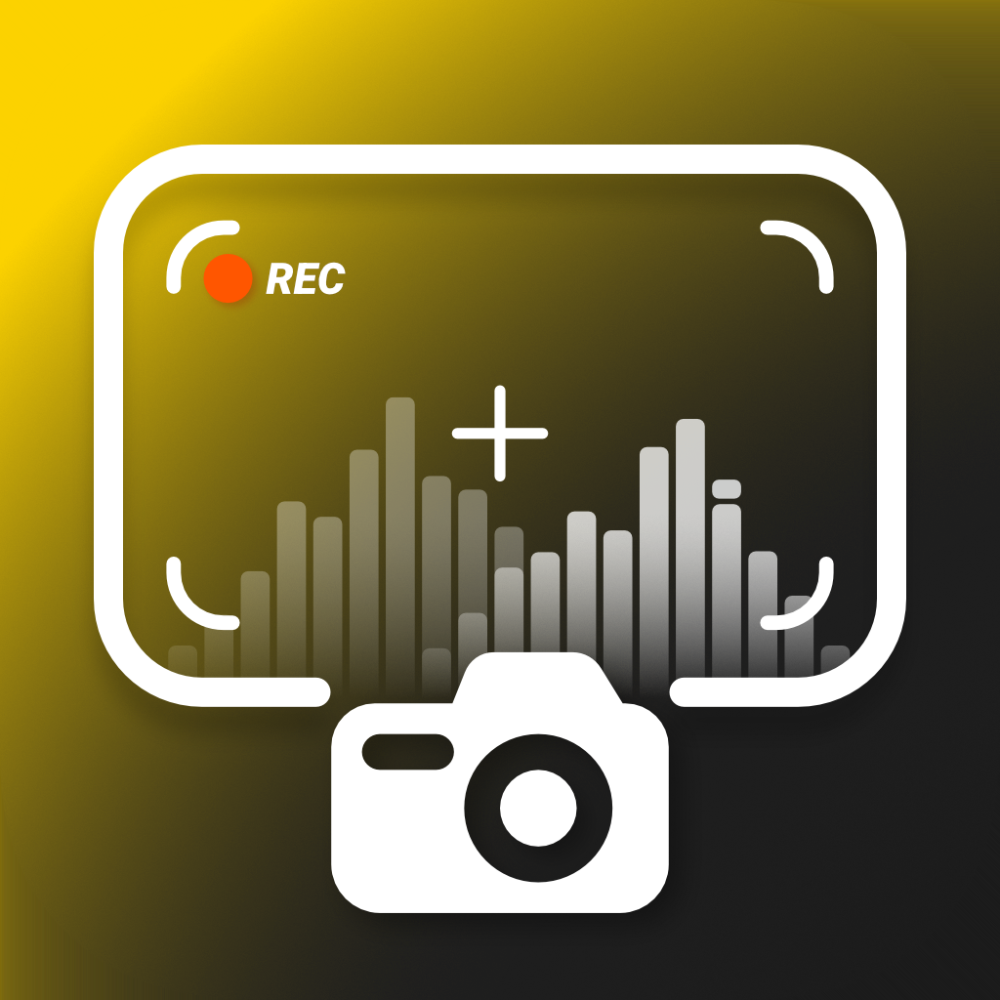
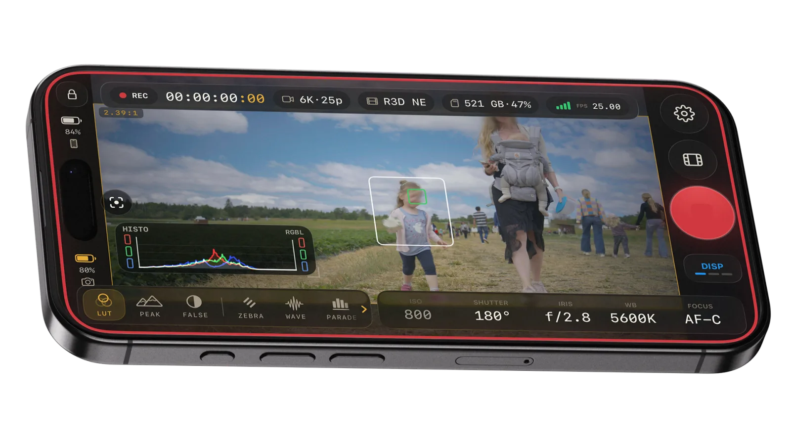
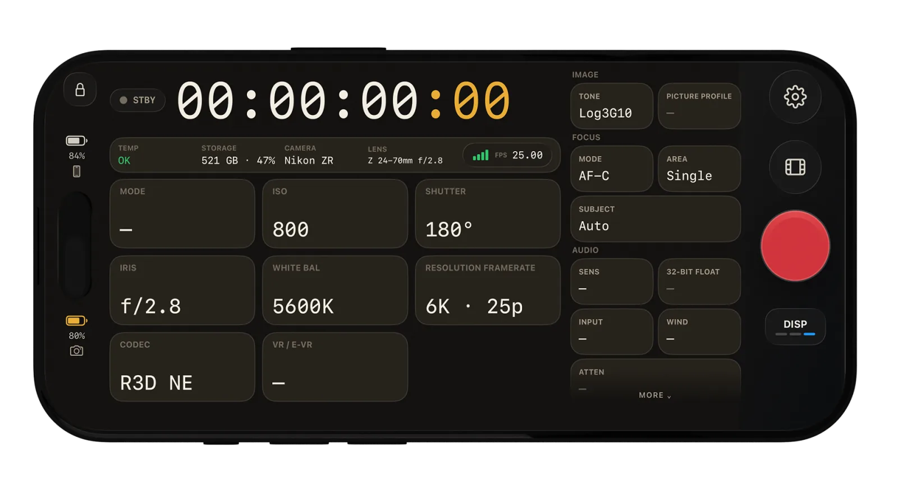
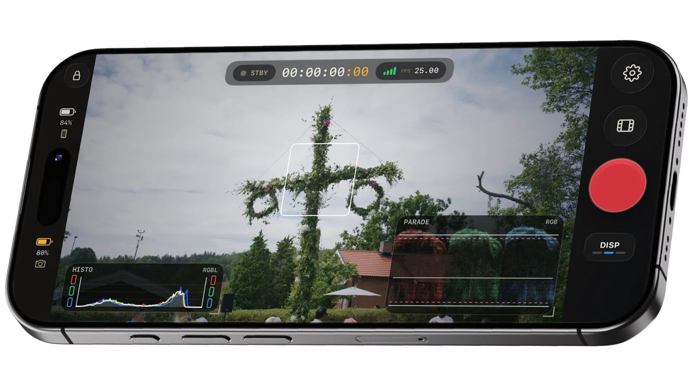
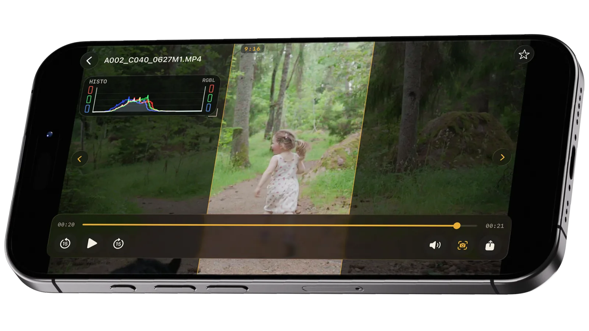
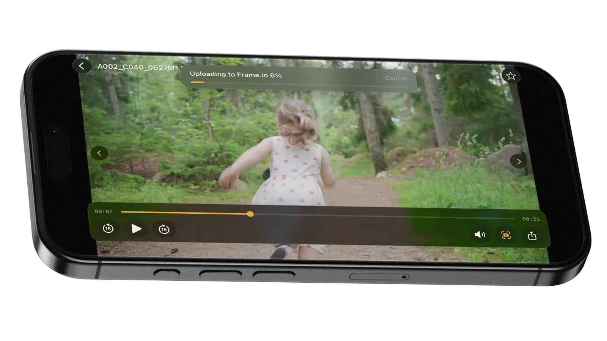

<div align="center">

<a href="https://opencapture.org/openzcine/">
  
</a>

# OpenZCine

**The open field monitor for Nikon Z.**<br>
Pro monitoring scopes, playback, full camera control, and Camera-to-Cloud export with LUT baking.
Free and open source.

[](https://github.com/erik-sutton95/OpenZCine/actions/workflows/ci.yml) [](https://opencapture.org/openzcine/docs/) [](LICENSE) [](https://github.com/erik-sutton95/OpenZCine/discussions)

[](https://testflight.apple.com/join/xu4d6UK8) [](https://play.google.com/store/apps/details?id=com.opencapture.openzcine) [](https://github.com/erik-sutton95/OpenZCine/releases/tag/sideload-v0.2.5-upright)

[Website](https://opencapture.org/openzcine/) · [Docs](https://opencapture.org/openzcine/docs/) · [Roadmap](https://github.com/erik-sutton95/OpenZCine/discussions/22) · [Report a bug](https://github.com/erik-sutton95/OpenZCine/issues/new?template=bug_report.yml)

<br>

<a href="https://opencapture.org/openzcine/">
  
</a>

</div>

<details>
<summary><strong>Table of contents</strong></summary>

- [Supported cameras](#supported-cameras)
- [Features](#features)
- [See it in action](#see-it-in-action)
- [Install](#install)
- [Roadmap](#roadmap)
- [Free. Open source. Yours](#free-open-source-yours)
- [For developers](#for-developers)
  - [Built with](#built-with)
  - [Architecture](#architecture)
  - [Build from source](#build-from-source)
  - [Documentation](#documentation)
- [Contributing](#contributing)
- [Support](#support)
- [Credits](#credits)
- [License](#license)

</details>

## Supported cameras

| Camera | Live view | Camera control | Notes |
| --- | :---: | :---: | --- |
| **Nikon ZR** | ✅ | ✅ | Primary hardware target. Current development and testing center on it. |
| **Nikon Z9** | ✅ | ✅ | |
| **Nikon Z5II** | ✅ | ✅ | |
| **Nikon Z6, Z6II, Z6III, Zf, Z8, Z7, Z7II** | ❔ | ❔ | Not yet tested on the camera. |

✅ working · ❔ untested.

> [!WARNING]
> The camera protocol is implemented from public sources and can be incomplete on bodies that have
> not been tested yet. Check that recording starts and stops on the camera body until you trust the
> link.

## Features

- **Read the image like a colorist.** Waveform, RGB parade, histogram, and vectorscope run live
  beside the image you are judging.
- **Catch exposure and focus before the take.** Codec-aware false color, zebras, RED-inspired
  Traffic Lights, and industry-standard focus peaking work directly on the monitor feed.
- **Frame once for every delivery.** Stack multiple aspect markers, custom frames, grids,
  crosshairs, level, and de-squeeze without losing sight of the shot.
- **Set the camera without touching the camera.** Control ISO, shutter angle, iris, white balance,
  recording format, frame rate, autofocus behavior, and recording from the device on your rig.
- **Stay connected.** Resilient Wi-Fi discovery, pairing, saved-camera profiles, and automatic
  reconnect, with a USB-C tethered transport alongside the primary Wi-Fi workflow.
- **Review before striking the set.** Browse clips, scrub playback, check scopes and markers, and
  preview the selected look on-device.
- **Ship it with the look baked in.** Apply built-in, RED, or custom `.cube` LUTs during export,
  then send through platform-native sharing or directly to [Frame.io](https://www.frame.io/).
- **Keep the monitor on your wrist.** Apple Watch and Wear OS companions mirror the live feed with
  its LUT, camera status, timecode, and remote record control.

iPhone, iPad, and Android phones share the monitor, assists, camera control, playback, and export,
with adaptive live-view thermal management during long sessions and recording. Nikon ZR is the
primary hardware target today. USB-C transport, both wearable companions, Bluetooth shutter
integration, and wider phone and tablet coverage continue to be hardened with real-world testing.

## See it in action

<table>
  <tr>
    <td width="50%" valign="top">
      <a href="https://opencapture.org/openzcine/#commander"></a>
      <br><strong>Camera control.</strong> ISO, shutter angle, iris, white balance, codec, and
      autofocus from the device on your rig.
    </td>
    <td width="50%" valign="top">
      <a href="https://opencapture.org/openzcine/#scopes"></a>
      <br><strong>Scopes.</strong> Histogram and RGB parade over the live camera view, with the
      on-set assists alongside.
    </td>
  </tr>
  <tr>
    <td width="50%" valign="top">
      <a href="https://opencapture.org/openzcine/#playback"></a>
      <br><strong>Playback.</strong> Review clips with the same scopes and assists as live view.
    </td>
    <td width="50%" valign="top">
      <a href="https://opencapture.org/openzcine/#export"></a>
      <br><strong>Camera-to-Cloud.</strong> Send a reviewed clip, with its look baked in, straight
      to Frame.io.
    </td>
  </tr>
</table>

## Install

| Platform | How | Notes |
| --- | --- | --- |
| **iPhone and iPad** | [Join the TestFlight](https://testflight.apple.com/join/xu4d6UK8) | One universal app, with the Apple Watch companion. |
| **Android** | [Public beta on Google Play](https://play.google.com/store/apps/details?id=com.opencapture.openzcine) | Android 10 or newer, arm64. |
| **Android without Play** | [Sideload APK](https://github.com/erik-sutton95/OpenZCine/releases/tag/sideload-v0.2.5-upright) (**0.2.5 (2)**) | For field monitors and devices without the Play Store. |

> [!NOTE]
> A sideload APK and a Google Play install are signed differently and cannot update each other.
> Remove the Play or APK-mirror copy before installing the APK.

Pairing and live view need a real Nikon Z camera nearby. Guides for both apps are in the
[docs](https://opencapture.org/openzcine/docs/).

## Roadmap

The roadmap lives in [GitHub Discussions](https://github.com/erik-sutton95/OpenZCine/discussions/22),
where every proposed feature has its own thread. Browse the
[Ideas category](https://github.com/erik-sutton95/OpenZCine/discussions/categories/ideas-feature-requests)
to vote, add production context, or propose what to tackle next. Roadmap threads describe
direction, not promised dates. Current engineering status is visible on the read-only
[OpenZCine Kaneo board](https://kaneo.opencapture.org/public-project/x8bqmvbho1am6f7ganbp72uq), and
engineering-phase detail lives in [`docs/ROADMAP.md`](docs/ROADMAP.md).

## Free. Open source. Yours

No subscriptions, no paywalls, no advertising, and no telemetry.
OpenZCine is Apache-2.0 licensed and deliberately, transparently built in public with Claude Code
and Codex, so filmmakers and developers can inspect, improve and adapt the tool they rely on.
Engineering guidelines live in [`AGENTS.md`](AGENTS.md).

## For developers

### Built with

[](https://www.swift.org/) [](https://developer.apple.com/xcode/swiftui/) [](https://developer.apple.com/metal/) [](https://kotlinlang.org/) [](https://developer.android.com/compose) [](https://www.vulkan.org/)

### Architecture

A shared Swift business and protocol core with native platform shells:

| Layer | Path | Purpose |
| --- | --- | --- |
| **Shared core** | `Sources/OpenZCineCore/` | PTP-IP protocol, camera state, Nikon property codes, discovery, pairing |
| **iOS app** | `ios/` | SwiftUI shell, Bonjour discovery, live-view rendering, camera I/O |
| **Android app** | `Apps/Android/app/` | Jetpack Compose phone shell and Android platform adapters |
| **Android facade** | `Sources/OpenZCineAndroidFacade/` | Swift session and JNI boundary for Android |
| **Wear OS** | `Apps/Android/wear/`, `Apps/Android/wear-relay/` | Wear UI and phone-mediated relay |
| **Tests** | `Tests/OpenZCineCoreTests/` | Swift package tests: packet encoding, property parsing, discovery, layout |
| **Prototype** | `reference/flutter-prototype/` | Archived Flutter reference, not part of production CI |

The shared core owns protocol logic and stays portable (no SwiftUI, UIKit or Android
dependencies). Platform shells own sockets, permissions, lifecycle, rendering and UI. See
[`docs/ARCHITECTURE.md`](docs/ARCHITECTURE.md) and the
[architecture decision](docs/design/specs/2026-06-20-production-native-architecture-design.md).

### Build from source

Tooling runs through [`just`](https://github.com/casey/just):

```bash
just setup                 # install meta-check tools (macOS / Homebrew)
just                       # list all recipes
just check                 # run repository quality checks
just format                # format Swift sources
just test                  # run Swift package tests
just native-check          # run Swift tests and build the native iOS app
just android-build         # build the Android app and staged Swift runtime
just android-check         # build, test, compile device tests, and lint Android
just android-release-check # verify the signed phone/Wear release pair
just bug-relay-check       # test the standalone anonymous bug-report relay
```

The iOS Xcode project is checked in:

```bash
open ios/Runner.xcodeproj
```

> [!TIP]
> Most of the app works without a camera: add `ZC_DEMO_AUTOSTART=1` to the `Runner` scheme's
> environment for a demo live-view session (see [`CONTRIBUTING.md`](CONTRIBUTING.md)). Pairing and
> live view need a real Nikon Z camera.

Releases: TestFlight builds come from Xcode Cloud, with a GitHub Actions fallback
([`docs/testflight-ci.md`](docs/testflight-ci.md)). Play testing and the sideload APK are in
[`docs/android-distribution.md`](docs/android-distribution.md).

### Documentation

- **[Docs](https://opencapture.org/openzcine/docs/)**: the OpenZCine handbook.
- [`docs/ARCHITECTURE.md`](docs/ARCHITECTURE.md): shared Swift core and platform shells
- [`docs/ROADMAP.md`](docs/ROADMAP.md): engineering phases and status
- [`docs/nikon-sdk.md`](docs/nikon-sdk.md): the public sources behind the camera protocol
- [`docs/flows/`](docs/flows/): user journeys and screen-level design as git-tracked Excalidraw
  diagrams (`.excalidraw`, open at [excalidraw.com](https://excalidraw.com) or with an editor
  extension) paired with markdown node cards. Conventions: [`docs/flows/README.md`](docs/flows/README.md)
- [`docs/design/`](docs/design/): design specs and implementation plans
- [`AGENTS.md`](AGENTS.md): always-loaded index for coding agents

OpenZCine went through an extended private R&D phase before publication; the public repository
starts from a clean slate with a squashed initial commit rather than carrying the experimental
history along.

## Contributing

Contributions are welcome.

- Read [`CONTRIBUTING.md`](CONTRIBUTING.md) for the development workflow, code standards, and how
  to report bugs vs. request features.
- **Report a Problem** offers two public-issue paths: an anonymous in-app report with no GitHub
  account (optional privacy-filtered activity events and user-selected, metadata-stripped
  screenshots), or a [signed-in GitHub issue](https://github.com/erik-sutton95/OpenZCine/issues/new?template=bug_report.yml)
  with richer optional details. Both paths are public.
- Before enabling that flow in a release, follow the secret-free GitHub App and Cloudflare
  provisioning steps in [`services/bug-relay/README.md`](services/bug-relay/README.md).
- Ideas and questions go in **GitHub Discussions** (an account is required):
  [Ideas](https://github.com/erik-sutton95/OpenZCine/discussions/categories/ideas-feature-requests) and
  [Q&A](https://github.com/erik-sutton95/OpenZCine/discussions/categories/q-a).
- Standardized labels help triage work; see [`.github/labels.yml`](.github/labels.yml).
- Please read the [`CODE_OF_CONDUCT.md`](CODE_OF_CONDUCT.md). For security issues, see
  [`SECURITY.md`](SECURITY.md).

<a href="https://github.com/erik-sutton95/OpenZCine/graphs/contributors">
  
</a>

## Support

I truly appreciate everyone who uses this project, files an issue, or sends a patch. Optional
[Buy Me a Coffee](https://buymeacoffee.com/eriksutton) contributions help keep the lights on. If
you would rather give to a charity, especially one that helps animals, that is just as welcome.

## Credits

The **R3D NE Monitor** built-in look was contributed by Wang Yuehua and ships with permission,
credited in the app's LUT picker beside the look itself. Nikon PTP/MTP property and operation codes
were cross-checked against the libgphoto2 project's public protocol tables; no libgphoto2 source is
included. Details for both are in [`THIRD-PARTY-NOTICES.md`](THIRD-PARTY-NOTICES.md).

## License

[Apache 2.0](LICENSE). Third-party licenses are listed in
[`THIRD-PARTY-NOTICES.md`](THIRD-PARTY-NOTICES.md). The app's privacy policy lives at
[opencapture.org/openzcine/privacy](https://opencapture.org/openzcine/privacy/).

This project is not affiliated with Nikon. No vendor SDK or proprietary Nikon documentation is
included in, distributed with, or required by this project. The camera protocol is implemented
from public sources; see [`docs/nikon-sdk.md`](docs/nikon-sdk.md).
"Nikon", "Nikon Z", "ZR", and "Z Cinema" are trademarks of Nikon Corporation, used here for
identification only.
