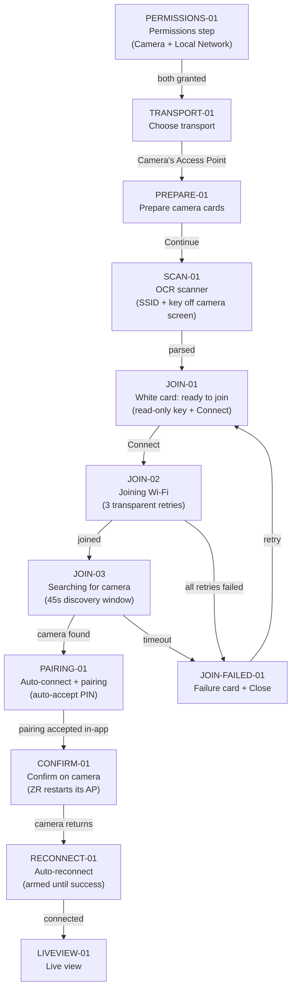

# Flow: First pair — Camera Access Point

The full journey from a fresh install to live view over the ZR's own Wi‑Fi. Every box below has
a node card with the detail; edit anything, Claude picks it up from the diff.

## Node cards

### PERMISSIONS-01 — Permissions step

- **Status:** shipped
- **Screen:** Wizard step 1: Camera + Local Network rows, Continue gated until BOTH granted.
- **Code:** `ios/Runner/StartupPermissions.swift`
- **Detail:** Local Network has no iOS status API — a self-published Bonjour beacon
  (`_ozcprobe._tcp`) + `NWBrowser` detect grant/deny; denial re-probes every 2s (Settings
  round-trips and the toggle-kills-the-app relaunch both self-heal). Camera reads
  `AVCaptureDevice.authorizationStatus`. Step skipped entirely when already satisfied.
- 📝 Notes:

### TRANSPORT-01 — Choose transport

- **Status:** shipped
- **Screen:** Three cards: Camera's Access Point (Simplest) / Phone's Hotspot (Best wireless) /
  USB-C (Most stable). Tap selects and advances.
- **Code:** `StartupDesign.swift` (`StartupFirstPairWizardView`), copy in `StartupWizardContent`.
- 📝 Notes:

### PREPARE-01 — Prepare camera

- **Status:** shipped
- **Screen:** Numbered instruction cards for putting the Nikon Z camera on its Connection wizard
  screen.
- **Code:** `StartupWizardPrepareCards` / `StartupWizardContent.preparationSteps(for:)`.
- 📝 Notes:

### SCAN-01 — OCR scanner

- **Status:** shipped
- **Screen:** VisionKit DataScanner reads SSID + key off the camera screen. The parser accepts the
  conservative shape shared by Nikon Z access points while preserving unfamiliar model/serial
  segments; the known ZR form retains its O/0, l/1, and S/5 recovery. Labels may be localized.
- **Code:** `CameraWiFiScannerView.swift`, core `CameraWiFiScreenParser.swift` (+ tests).
- **Detail:** **Enter manually** accepts the exact camera SSID and standard 8–63-character WPA key
  when glare, unavailable scanning, or a future SSID layout prevents automatic capture. Scan and
  manual entry both feed the same staged join popup and normal join pipeline.
- 📝 Notes:

### JOIN-01 — Ready to join (white card)

- **Status:** shipped
- **Screen:** Light card (scanner-matching): SSID title, read-only monospaced key chip for OCR
  results, source-appropriate verification copy, Connect, Cancel. Wrong OCR ⇒ Cancel + rescan or
  enter the exact details manually.
- **Code:** `ConnectionProgressSheet.swift` (single light card for ALL phases now).
- 📝 Notes:

### JOIN-02 — Joining Wi‑Fi

- **Status:** shipped
- **Detail:** `NEHotspotConfiguration` apply with up to 3 attempts, 2s apart (first-attempt
  association flake right after the ZR raises its AP is routine); "Don't Join" on the iOS alert
  never loops. Password persisted to keychain on first resolve; a `.system` failure clears it
  only after the FINAL attempt. Join confirmation falls back to IPv4-subnet detection when the
  wifi-info entitlement can't read the SSID.
- **Code:** `NativeAppRoot.runCameraWiFiJoin`, `WiFiJoinCoordinator.swift`.
- 📝 Notes:

### JOIN-03 — Searching for camera

- **Status:** shipped
- **Detail:** Discovery restarts with cleared results (stale pre-join entries would auto-pair a
  dead host); 45s window at 250ms polls — one discovery pass alone (1.4s Bonjour + subnet probe)
  can run past 10s, so the original 8s window failed on-device every time.
- **Code:** `runCameraWiFiJoin` post-join block; `NativeCameraDiscovery.swift`.
- 📝 Notes:

### JOIN-FAILED-01 — Failure card

- **Status:** shipped
- **Detail:** In-card message + Close (failure text pinned in `connectionFailureDetail` — the
  live `connectionMessage` gets overwritten by the discovery loop). Close returns to the wizard;
  retrying re-runs from JOIN-01 with the keychain key.
- 📝 Notes:

### PAIRING-01 — Auto-connect + pairing

- **Status:** shipped
- **Detail:** First discovery candidate chains straight into `connectToCamera` (no drop back to
  the wizard). Pairing PIN auto-accepts; strategy resolves saved-vs-first-time per host.
- 📝 Notes:

### CONFIRM-01 — Confirm on camera

- **Status:** shipped
- **Screen:** White card, phase `confirmOnCamera`: “Tap ‘Confirm’ on <camera>. It will restart
  its Wi‑Fi — we'll reconnect automatically.” Phase-anchored (message fields get stomped by the
  discovery loop).
- **Code:** core `ConnectionProgress.swift`, `transitionToSavedCameraNetworkCheck`.
- 📝 Notes:

### RECONNECT-01 — Auto-reconnect

- **Status:** shipped
- **Detail:** Paired-reconnect watcher re-applies the camera network (throttled 5s) and retries
  the PTP connect on every discovery pass until one SUCCEEDS (the ZR can hold the pre-drop
  session and time out the first Init); disarms on success or operator Cancel.
- **Code:** `applyDiscoveryResults`, `attemptPairedReconnectRejoin`.
- 📝 Notes:

### LIVEVIEW-01 — Live view

- **Status:** shipped
- **Detail:** `enterLiveView()` immediately on connect; wizard marked completed; camera saved.
- 📝 Notes:
