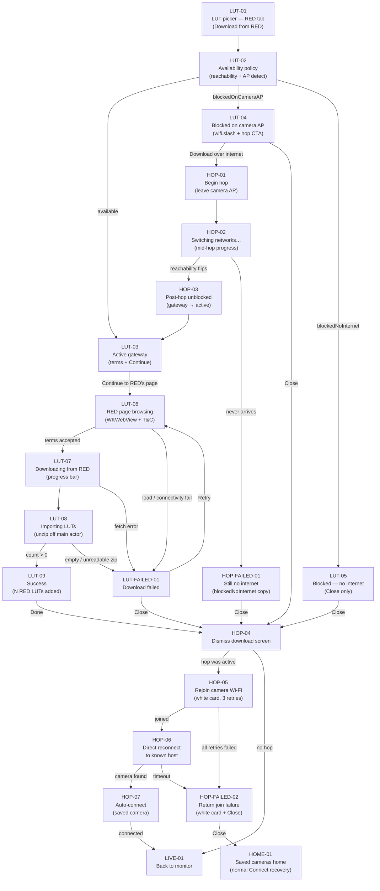

# Flow: Internet hop — RED LUT download (camera AP + internet)

The journey from the LUT picker on a camera-AP session through leaving the ZR's Wi‑Fi, downloading
RED's IPP2 presets, and rejoining the camera network. Every box below has a node card with the
detail; edit anything, Claude picks it up from the diff.

**Prerequisite:** the operator is already connected over the camera's access point (see
[camera-ap-join.md](./camera-ap-join.md)). This flow also shares hop machinery with Frame.io
delivery — that path is documented separately.

## Node cards

### LUT-01 — LUT picker entry

- **Status:** shipped
- **Screen:** Monitor → LUT assist → RED tab. When no RED LUTs are on disk, shows placeholder
  copy and a **Download from RED** button (enabled even while blocked — the download screen
  explains why).
- **Code:** `MonitorPanels.swift` (`redTab`, `downloadRedButton`), `NativeAppRoot.swift`
  (`isRedDownloadPresented` full-screen cover).
- **Detail:** `refreshRedLUTs()` runs when the picker opens. Demo env `ZC_DEMO_OPEN_RED` can
  stage the download cover on launch.
- 📝 Notes:

### LUT-02 — Availability policy

- **Status:** shipped
- **Detail:** `InternetReachability` publishes `hasNetworkPath` (`NWPathMonitor`) and
  `connectedSSID` (`NEHotspotNetwork.fetchCurrent`, debounced 2 s). Core
  `RedLUTDownloadPolicy.availability(hasInternetPath:isOnCameraAccessPoint:)` resolves three
  states: camera AP checked first (satisfied path but no WAN), then generic no-path, else
  available. Camera-AP detection uses `CameraWiFiJoinPolicy.isOnCameraAccessPoint` with the shared,
  conservative Nikon Z SSID classifier rather than a model-specific prefix.
- **Code:** `RedLUTDownloadPolicy.swift`, `InternetReachability.swift`,
  `CameraWiFiSSID.swift` (`CameraWiFiJoinPolicy`), `RedLUTDownloadPolicyTests.swift`.
- 📝 Notes:

### LUT-03 — Active gateway

- **Status:** shipped
- **Screen:** Shield icon, RED terms copy, **Continue to RED's page** (safari). Gated on
  `availability.isAvailable`.
- **Code:** `RedDownloadView.swift` (`activeGateway`).
- 📝 Notes:

### LUT-04 — Blocked on camera AP

- **Status:** shipped
- **Screen:** Orange `wifi.slash`, **Internet required**, blocked reason ("you're on the
  camera's Wi‑Fi, which has no internet"), primary **Download over internet** with sub-line
  "We'll hop off the camera's Wi‑Fi to download, then reconnect your camera automatically.",
  **Close**.
- **Code:** `RedDownloadView.swift` (`blockedGateway`).
- **Detail:** Demo env `ZC_DEMO_RED_BLOCKED=ap` forces this state in the simulator (which can
  never actually join a camera AP).
- 📝 Notes:

### LUT-05 — Blocked — no internet

- **Status:** shipped
- **Screen:** Same blocked layout as LUT-04 but no hop CTA — only reason text and **Close**.
  Applies when the phone is off the camera AP but has no satisfied network path.
- **Code:** `RedDownloadView.swift` (`blockedGateway`, `availability != .blockedOnCameraAccessPoint`).
- **Detail:** Demo env `ZC_DEMO_RED_BLOCKED=off` forces this state.
- 📝 Notes:

### HOP-01 — Begin hop

- **Status:** shipped
- **Detail:** `NativeAppModel.beginInternetHop()`: sets `internetHopActive`, captures
  `(host, ssid)` for return, stops the discovery loop, tears down the PTP session
  (`disconnectCameraSession`), clears `connectedWiFiSSID` (stale SSID would keep AP detection
  true), calls `WiFiJoinCoordinator.leaveCameraNetwork(ssid:)` →
  `NEHotspotConfigurationManager.removeConfiguration(forSSID:)`. iOS drops the AP and falls
  back to home Wi‑Fi or cellular on its own. If hop started from the monitor media panel,
  re-hosts the media browser standalone so share context survives.
- **Code:** `NativeAppRoot.swift` (`beginInternetHop`), `WiFiJoinCoordinator.swift`
  (`leaveCameraNetwork`). Keychain password survives removal so return can re-apply.
- 📝 Notes:

### HOP-02 — Switching networks

- **Status:** shipped
- **Screen:** Blocked gateway swaps reason text for a **Switching networks…** progress row while
  `model.internetHopActive`. **Close** remains available (abandon → return path on dismiss).
- **Code:** `RedDownloadView.swift` (`blockedGateway`, `model.internetHopActive`).
- **Detail:** RED download does **not** call `waitForInternetPath` — unblock is reactive: when
  `InternetReachability.redLUTDownloadAvailability` flips to `.available`, the gateway becomes
  LUT-03 automatically. Frame.io delivery uses the same hop but actively waits (30 s) — see
  `MediaDeliveryOverlay.swift`.
- 📝 Notes:

### HOP-03 — Post-hop unblocked

- **Status:** shipped
- **Detail:** Transient — the blocked gateway disappears and LUT-03 renders as soon as
  reachability reports off-AP + satisfied path. Operator taps **Continue to RED's page** to
  enter the download flow.
- 📝 Notes:

### HOP-FAILED-01 — No internet after hop

- **Status:** shipped
- **Screen:** Gateway settles into LUT-05 copy (`.blockedNoInternet`) if iOS never lands on a
  usable path. **Close** triggers HOP-04 (rejoin camera).
- **Code:** `RedLUTDownloadPolicy` (`.blockedNoInternet`), `RedDownloadView.swift`.
- 📝 Notes:

### LUT-06 — RED page browsing

- **Status:** shipped
- **Screen:** Full-screen `WKWebView` loads RED's IPP2 Output Presets URL. Native loading cover
  until page commits; injected JS reshapes RED's T&C modal, rejects cookie banner, auto-opens
  terms. App **xmark** close (RED's in-modal close hidden).
- **Code:** `RedDownloadView.swift` (`RedWebView`, `loadingCover`, `helperJS`).
- **Detail:** 25 s page-load watchdog surfaces connectivity failure. `onChange` of reachability
  fails active browsing/downloading/importing phases if the path blocks mid-flow.
- 📝 Notes:

### LUT-07 — Downloading from RED

- **Status:** shipped
- **Screen:** Opaque `DownloadStatusView`: arrow icon, linear progress bar, percent. Triggered
  when RED's accept button calls `window.open` on the zip URL — coordinator intercepts and
  fetches via `URLSession` with cached cookies + user agent (not in-page navigation).
- **Code:** `RedDownloadView.swift` (`DownloadStatusView`, `RedWebView.Coordinator`).
- **Detail:** Host allowlist: `reddigitalcinema.com`, `red.com`, `s3.amazonaws.com/red-4/`.
  Unexpected hosts blocked.
- 📝 Notes:

### LUT-08 — Importing LUTs

- **Status:** shipped
- **Screen:** Spinner + "Adding LUTs…". Unzip runs off the main actor; temp zip deleted after
  import.
- **Code:** `NativeAppRoot.importRedZip(from:)`, `RedDownloadView` `onDownloaded` handler.
- **Detail:** Selects `LUTLibraryIndex.defaultRedLUT` (REC.709 medium-contrast preference),
  enables LUT assist, returns count to caller.
- 📝 Notes:

### LUT-09 — Success

- **Status:** shipped
- **Screen:** Green checkmark, "N RED LUT(s) added", hint to find them under the RED tab,
  **Done** (dismisses → HOP-04 if hop active).
- **Code:** `RedDownloadView.swift` (`DownloadStatusView`).
- 📝 Notes:

### LUT-FAILED-01 — Download failed

- **Status:** shipped
- **Screen:** Orange warning, failure message (connectivity, HTTP error, empty zip, mid-flow
  path loss), **Retry** + **Close**. Retry re-checks availability before reloading the web view.
- **Code:** `RedDownloadView.swift` (`DownloadStatusView`, `onChange` reachability guard).
- 📝 Notes:

### HOP-04 — Dismiss download screen

- **Status:** shipped
- **Detail:** `RedDownloadView.onDisappear` calls `model.endInternetHop()` — no-op when no hop
  was started. If a hop ran, arms the return pipeline (HOP-05). Also fired from gateway
  **Close**, success **Done**, and failure **Close**.
- **Code:** `RedDownloadView.swift`, `NativeAppRoot.swift` (`endInternetHop`).
- 📝 Notes:

### HOP-05 — Rejoin camera Wi‑Fi

- **Status:** shipped
- **Screen:** Connection progress white card — same join UX as first-pair (JOIN-02 language).
- **Detail:** `endInternetHop()` presents the connection popup and runs the **full**
  `runCameraWiFiJoin(target: .specificSSID, joinStrategy: .hotspotConfigurationOnly,
  reconnectHost: hopReturn.host)` pipeline. Up to 3 transparent join retries, 2 s apart.
  Removing the hotspot config on hop-out may re-prompt iOS "Wants to Join" on return — expected
  trade-off.
- **Code:** `NativeAppRoot.swift` (`endInternetHop`, `runCameraWiFiJoin`),
  `ConnectionProgressSheet.swift`, `WiFiJoinCoordinator.swift`.
- 📝 Notes:

### HOP-06 — Direct reconnect to known host (retried)

- **Status:** shipped
- **Detail:** Fixed 2026-07-05 (two rounds). The post-join step **retries a direct connect** to
  the captured `internetHopReturn.host` — `cameraHost = reconnectHost; connectToCamera()` in a
  loop (up to 6 attempts, 2 s apart) — **skipping Bonjour discovery entirely**. Two post-hop
  obstacles, each cleared by one half of the fix: **(a)** the ZR doesn't reliably re-advertise
  `_ptp._tcp` after a hop, so the old discovery-only rejoin stalled on "searching" → "couldn't
  find the camera" (fixed by using the known host, no discovery); **(b)** the ZR holds its
  pre-drop PTP session and lets the first Init(s) time out (~10 s each, the socket Init-ack
  timeout), so a single direct attempt lands on "couldn't connect" (fixed by retrying until an
  Init lands). `connectToCamera` single-flights so attempts never stack; the loop stops on
  success, on `isConnectionProgressPresented` going false (operator Cancel), or after 6 tries.
  The fresh first-pair path (no known host) still discovers.
- **Code:** `runCameraWiFiJoin` post-join block (`reconnectHost` retry loop),
  `NativeAppRoot.connectToCamera`; `PTPIPTransport` socket Init-ack timeout 10 s.
- 📝 Notes:

### HOP-07 — Auto-connect

- **Status:** shipped
- **Detail:** `connectToCamera()` on the known host runs the saved-camera silent reconnect (host
  matches a saved record → no pairing wizard). For the fresh-pair path only, the first discovery
  candidate chains in instead.
- **Code:** `runCameraWiFiJoin`, `NativeAppRoot.connectToCamera`.
- 📝 Notes:

### HOP-FAILED-02 — Return join failure

- **Status:** shipped
- **Screen:** White card failure message (join exhausted or discovery timeout) + **Close**.
- **Detail:** Operator lands on saved-cameras home with normal **Connect** recovery — no new
  failure surface beyond the connection popup.
- **Code:** `surfaceCameraWiFiJoinFailure`, `ConnectionProgressSheet.swift`.
- 📝 Notes:

### LIVE-01 — Back to monitor

- **Status:** shipped
- **Detail:** Live view resumes after reconnect; downloaded RED LUTs appear in the LUT picker RED
  tab drum on next open.
- 📝 Notes:

### HOME-01 — Saved cameras home

- **Status:** shipped
- **Detail:** Fallback when return join/discovery fails — camera row shows with standard Connect
  affordance.
- 📝 Notes:

## Proposed / not shipped

| Item | Status | Source |
| ---- | ------ | ------ |
| Cellular-pinned download while staying on camera AP | rejected | Design spec — `URLSession` cannot pin interface; excludes non-cellular devices |
| Pre-shoot "connect to internet before RED download" nudge | proposed | Design spec — may be added independently; not in code |
| `beginRedLUTInternetHop` / `endRedLUTInternetHop` naming | shipped (renamed) | Shipped as `beginInternetHop` / `endInternetHop` |
| Return via paired-reconnect reapply only | shipped (superseded) | Design spec proposed `pendingPairedReconnect*`; shipped uses full `runCameraWiFiJoin` |
