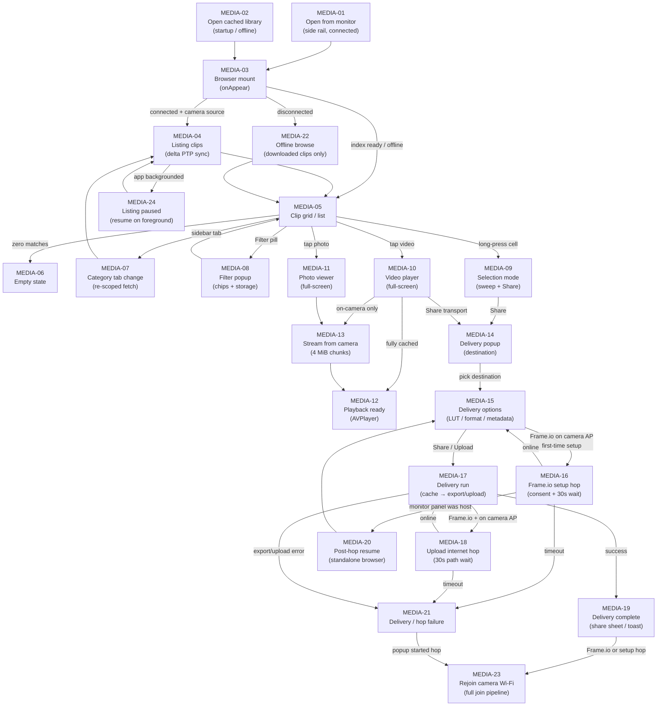

# Flow: Media browsing

From opening the Media panel through clip discovery, preview, progressive cache, and delivery
(Share / Frame.io). Every box below has a node card with the detail; edit anything, Claude picks
it up from the diff.

## Node cards

### MEDIA-01 — Open from monitor

- **Status:** shipped
- **Screen:** Live monitor side rail → Media button (`IconMedia` / rectangle.stack). Sets
  `activePanel = .media`; `MediaBrowserView` hosts inside the monitor panel stack.
- **Code:** `MonitorExperience.swift` (`mediaButton`), `MonitorPanels.swift` (`.media` case),
  `NativeAppRoot.swift` (`activePanel`).
- **Detail:** Requires a connected session for on-camera listing; `mediaBrowserSource` stays
  `.camera` (default). Close via top-left `CloseButton` → `dismissActivePanel()` (panel fade, not
  full-screen cover).
- 📝 Notes:

### MEDIA-02 — Open cached library

- **Status:** shipped
- **Screen:** Startup home → Media library button (compact on wizard, full on link screen). Opens
  a standalone `fullScreenCover` over startup — not the monitor panel.
- **Code:** `StartupDesign.swift` (`StartupMediaLibraryButton`), `NativeAppRoot.openCachedMediaLibrary`,
  `NativeAppRoot.swift` (`standaloneMediaLibraryPresented` binding).
- **Detail:** Opens with `mediaBrowserSource = .camera`; offline that aggregates **every**
  per-serial cache bucket (`listAllCachedClips()`) and `filteredMediaClips` keeps only fully
  downloaded clips. (Bug fixed 2026-07-05: it used to force `.iPhone`, which lists only the
  `local` iPhone-import bucket — camera downloads live in per-serial buckets, so the library
  opened empty; the onAppear `.iPhone`→`.camera` fallback is disabled for the standalone
  cover.) Close via `CloseButton` → `dismissMediaLibrary()`.
- 📝 Notes:

### MEDIA-03 — Browser mount

- **Status:** shipped
- **Screen:** Full Media page: 172pt sidebar (category tabs, optional storage cards, grid-density
  controls), main column header (`MULTIMEDIA` + tab title + count), grid or list, top-left close.
- **Code:** `MediaBrowser.swift` (`MediaBrowserView.onAppear`), `NativeAppRoot.refreshMediaClips`,
  `scheduleFetchClipsFromCamera`, `refreshMediaStorageSlots`.
- **Detail:** On appear: reload index from disk; handle `pendingHopShareResumeClips` (MEDIA-20);
  refresh storage slot cards when connected; if connected and source is `.camera`, cancel any stale
  listing task and start a fresh `fetchClipsFromCamera` pass. Registers
  `MediaDeliveryCoordinator.enterLocalOverlayContext()` for on-clip delivery chrome. Demo env
  `ZC_DEMO_OPEN_MEDIA=play` auto-opens the first downloaded clip in the player.
- 📝 Notes:

### MEDIA-04 — Listing clips

- **Status:** shipped
- **Screen:** Main column shows `ProgressView` + “Listing clips on camera…”; header shows
  “Scanning…” or “Listing… N found” while `mediaFetchInProgress`.
- **Code:** `NativeAppRoot.fetchClipsFromCamera`, `NativeCameraSession.listMediaObjectHandles` /
  `fetchMediaClip`, core `MediaClipDiscoveryDelta.swift`, `R3DClipIndex.swift`,
  `PTPOperation.swift` (`PTPObjectInfo`).
- **Detail:** Delta sync against cached `index.json`: reuse handles skip `GetObjectInfo`; new handles
  fetch metadata; removed handles evict index entries (local files kept when fully downloaded).
  Scoped to active sidebar category (Videos/Photos run format-scoped handle partitions when the body
  honours them — see Status: question). Batches upserts of 32 clips or every **120 ms**; yields every
  32 processed handles. Tab-specific “learn-then-skip” writes off-tab records to the index without
  counting them in the live listing. Cancelled passes guard on `mediaFetchGeneration` so a late finish
  cannot clear a successor's state. App background cancels the task and sets
  `mediaFetchInterruptedByBackground` (MEDIA-24).
- 📝 Notes:

### MEDIA-05 — Clip grid / list

- **Status:** shipped
- **Screen:** Lazy grid (S/M/L density) or list rows; per-cell thumbnail, filename, favorite star;
  cache ring overlay when streaming or partially cached. Header: FILTER + SORT pills; optional
  “CACHING filename N%” bar for the active stream.
- **Code:** `MediaBrowser.swift` (`MediaClipCell`, `MediaClipListRow`, `MediaCellImageLoader`),
  `NativeAppRoot.filteredMediaClips`, `MediaLibrary.swift` (`MediaClip`, filters, sort),
  `Sources/OpenZCineCore/MediaClipFilename.swift`.
- **Detail:** Filters compose with AND semantics: hide raw `.R3D` when a playable proxy stem exists;
  category tab (All / Videos / Photos / Favorites); format chips (MOV/MP4); resolution buckets;
  TODAY; storage slot. Sort cycles newest → oldest → name (persisted). Thumbnails: `ensureThumbnail`
  queues PTP `GetThumb` with **max 48** queued fetches (drops oldest on fast scroll). Cells decode
  downsampled stills off the main actor. Long-press (**0.4 s**) enters selection; horizontal drag in
  selection mode sweep-selects (Photos-style, no edge auto-scroll).
- 📝 Notes:

### MEDIA-06 — Empty state

- **Status:** shipped
- **Screen:** Film-stack icon + title/subtitle explaining no clips, no matches, or offline with
  nothing downloaded.
- **Code:** `MediaBrowser.swift` (`emptyState`, `listingState`).
- **Detail:** Distinguishes connected vs offline copy. When disconnected, only fully downloaded
  clips pass `filteredMediaClips` — an empty grid with active filters suggests clearing filters or
  switching tabs.
- 📝 Notes:

### MEDIA-07 — Category tab change

- **Status:** shipped
- **Screen:** Sidebar tabs All / Videos / Photos / Favorites; active tab highlighted in accent glass.
- **Code:** `MediaBrowser.swift` (`categoryTabs`), `NativeAppModel.mediaCategoryTab` `didSet` →
  `scheduleFetchClipsFromCamera`.
- **Detail:** Changing tabs while connected and source is `.camera` re-runs the delta pass scoped
  to the new category so unfetched handles for that tab jump the queue. Cached metadata costs
  nothing; only new handles hit the camera.
- 📝 Notes:

### MEDIA-08 — Filter popup

- **Status:** shipped
- **Screen:** 400pt glass panel anchored under the FILTER pill: FORMAT (MOV/MP4), RESOLUTION,
  DATE (TODAY), STORAGE (per slot when connected), Clear all filters. Dimmed backdrop tap closes.
- **Code:** `MediaBrowser.swift` (`MediaFilterPopup`, `filterPopupOverlay`),
  `NativeAppRoot.clearMediaFilters`, `MediaBrowserFilterMetrics`.
- **Detail:** Storage slot chips mirror sidebar storage cards (same `mediaStorageSlotFilter` state).
  Active filter count badges the FILTER pill.
- 📝 Notes:

### MEDIA-09 — Selection mode

- **Status:** shipped
- **Screen:** Header swaps to “N selected” + Share pill; sidebar tap exits selection. Grid drag
  (horizontal-leading, min distance 12pt) sweep-selects/deselects with haptics.
- **Code:** `MediaBrowser.swift` (`selectionHeader`, `handleSelectionDrag`, `beginSelection`).
- **Detail:** Share opens `MediaDeliveryPopupOverlay` anchored on the Share button with all selected
  clips. Tap cells toggles selection while active; tap outside sidebar exits.
- 📝 Notes:

### MEDIA-10 — Video player

- **Status:** shipped
- **Detailed flow:** [media-playback.md](./media-playback.md) (PLAY-03 onward) — this card is the
  entry stub; streaming, AVPlayer setup, transport, scopes, and teardown live there.
- **Screen:** Full-screen AVPlayer with top bar (close, filename, favorite, share, assist), bottom
  transport (play/pause, ±15s, scrubber, mute), optional clip prev/next arrows, pinch/pan zoom,
  single-tap play/pause flash, long-press horizontal frame scrub (**0.35 s**), playback scopes
  (waveform/parade/histogram/traffic lights when enabled in preferences).
- **Code:** `MediaBrowser.swift` (`MediaPlayerView`), `MediaPlaybackAudioSession`.
- **Detail:** Opens via `fullScreenCover` on `playingClip`. On dismiss: `cancelClipStream`,
  teardown player, deactivate audio session. Share opens delivery popup above the share button;
  delivery overlay pins to top when a run is active. Clip navigation slides between filtered-list
  neighbors.
- 📝 Notes:

### MEDIA-11 — Photo viewer

- **Status:** shipped
- **Detailed flow:** [media-playback.md](./media-playback.md) (PLAY-02 / PLAY-14) — progressive
  photo load is documented there.
- **Screen:** Black full-screen still with pinch zoom (1×–4×), close + filename top bar, loading
  spinner while fetching.
- **Code:** `MediaBrowser.swift` (`MediaPhotoViewer`).
- **Detail:** Shows cached thumbnail first if present, then streams full image from camera when not
  local (same progressive cache path as video). Poll interval **400 ms** while growing partial file.
  On disappear: cancel clip stream.
- 📝 Notes:

### MEDIA-12 — Playback ready

- **Status:** shipped
- **Detail:** Cached clip: `loadPlayerItem()` immediately. Partial cache: `pollUntilPlayable` probes
  `AVURLAsset.isPlayable` every **400 ms** (recreates asset after failed probe on growing file).
  Progressive stream can start playback before 100% cached. LUT composition applied when assist LUT
  visible; demo env `ZC_DEMO_MEDIA_LUT=1` forces LUT on at load.
- **Code:** `MediaBrowser.swift` (`loadActiveClip`, `pollUntilPlayable`, `loadPlayerItem`),
  `MediaLUTExport.swift` / playback effects box.
- 📝 Notes:

### MEDIA-13 — Stream from camera

- **Status:** shipped
- **Detail:** `startClipStream` → `streamClip`: resumes partial file at existing byte offset;
  `GetPartialObject` in **4 MiB** chunks; progress published on `mediaDownloadProgress` and
  `clipBufferedFraction`. Single-flight per clip (`mediaDownloadInFlight`); concurrent callers
  wait **50 ms** polls. Failure removes partial file. Thumbnails use separate single-worker queue
  (not the data stream). Listing and streaming share one PTP data channel — sequential by design.
- **Code:** `NativeAppRoot.streamClip`, `NativeCameraSession.getPartialObject` / `getThumb`,
  `MediaClipStore.openForStreaming`.
- 📝 Notes:

### MEDIA-14 — Delivery popup (destination)

- **Status:** shipped
- **Screen:** Anchored glass popup (~420pt): clip count summary, destination rows Share / Frame.io.
  Frame.io row disabled when not configured or not signed in (sign-in lives in Settings → Storage).
- **Code:** `MediaDeliveryPopup.swift`, `MediaDeliveryPopupOverlay`, `MediaDelivery.swift`
  (`MediaDeliveryDestination`).
- **Detail:** Entry from selection Share, player share button, or post-hop resume
  (`preferredDestination: .frameio`). Backdrop tap or Close dismisses; if popup started a hop without
  delivering, `closePopup` calls `endInternetHop()` to rejoin the camera.
- 📝 Notes:

### MEDIA-15 — Delivery options

- **Status:** shipped
- **Screen:** Options step: bake LUT toggle (off when no LUT selected), export format MOV/MP4,
  include metadata, Frame.io project picker / create project, force re-upload. Footer: segmented
  Share vs Save to Photos (native only) + action button.
- **Code:** `MediaDeliveryPopup.swift` (`optionsSection`, `optionsFooter`),
  `MediaDeliveryConfiguration`, `Frameio/FrameioModel.swift`.
- **Detail:** Continue enabled when destination set and clips are deliverable: locally cached clips
  **or** connected camera (on-camera clips cache automatically in the runner). LUT bake requires
  `currentLUTCube()`. Frame.io on camera AP without persisted project relies on hop + auto-pick
  (MEDIA-16) or upload-time hop (MEDIA-18).
- 📝 Notes:

### MEDIA-16 — Frame.io setup hop

- **Status:** shipped
- **Screen:** Alert “Leave camera Wi‑Fi?” → Switch; Frame.io section shows hopping spinner and
  polls AP state every **1 s** until online, then loads projects (Adobe sign-in if needed).
- **Code:** `MediaDeliveryPopup.swift` (`startFrameioHop`, `frameioOnCameraSection`),
  `NativeAppRoot.beginInternetHop`, `waitForInternetPath(timeoutSeconds: 30)`.
- **Detail:** Sets `pendingHopShareResumeClips` before hop when monitor media panel was host (MEDIA-20).
  `popupStartedHop` tracks abandon-on-close rejoin. On timeout surfaces error in popup; does not
  start delivery.
- 📝 Notes:

### MEDIA-17 — Delivery run

- **Status:** shipped
- **Screen:** Top `MediaDeliveryOverlay` progress pill: “Caching from camera…”, “Preparing…”, or
  “Uploading to Frame.io” with percent and batch line (“Clip M of N”).
- **Code:** `MediaDeliveryOverlay.swift` (`MediaDeliveryRunner`, `MediaDeliveryCoordinator`),
  `MediaDelivery.swift` (`deliverClipsForShare`, `uploadClipsToFrameio`), `MediaLUTExport.swift`.
- **Detail:** Pre-pass sequentially caches any selected on-camera clips (`cacheClipFromCamera` → same
  `streamClip`). Then exports with optional LUT bake (sets `exportStatus` exported/failed) or uploads
  to Frame.io (skips already-uploaded unless force re-upload). Progress mirror polls model download
  map every **200 ms** during cache. Native share stages copies via `MediaShareStaging`; Photos save
  uses `MediaPhotosSaver`. Cancel clears overlay and invokes `onCancel` (resumes player if paused for
  delivery).
- 📝 Notes:

### MEDIA-18 — Upload internet hop

- **Status:** shipped
- **Detail:** When destination is Frame.io and `isOnCameraAccessPoint`, runner calls
  `beginInternetHop()` before upload, overlay shows “Switching networks…”, then
  `waitForInternetPath` up to **30 s** (500 ms poll steps). Success proceeds to upload; failure
  message: “Couldn't reach the internet after leaving the camera's Wi‑Fi…”. `defer` always calls
  `endInternetHop()` after upload completes or fails (MEDIA-23).
- **Code:** `MediaDeliveryOverlay.swift` (`MediaDeliveryRunner.execute`), `NativeAppRoot.swift`
  (hop helpers), `InternetReachability.swift` / `CameraWiFiJoinPolicy`.
- 📝 Notes:

### MEDIA-19 — Delivery complete

- **Status:** shipped
- **Screen:** Native share: system share sheet (`mediaDeliveryShareSheet`). Photos: toast “Saved N
  clip(s) to Photos”. Frame.io: summary toast (uploaded/skipped counts). Browser/player also show
  `completionToast` capsule for **2.5 s** when local overlay active.
- **Code:** `MediaDeliveryCoordinator.handleOutcome`, `MediaDeliveryGlobalOverlay`,
  `MediaBrowser.swift` (delivery toast ZStack).
- **Detail:** Share sheet keeps playback paused until dismiss (`onDismiss: resumePlaybackIfNeeded`).
  Staging directory cleaned after share completes.
- 📝 Notes:

### MEDIA-20 — Post-hop resume

- **Status:** shipped
- **Detail:** `beginInternetHop` while `activePanel == .media` collapses the monitor and re-hosts
  `MediaBrowserView` as standalone (`isStandaloneMediaLibraryPresented`). Stashed
  `pendingHopShareResumeClips` restores on browser appear: single cached clip → player with share
  popup on Frame.io; multiple clips → share popup over grid. Cleared after consume.
- **Code:** `NativeAppRoot.beginInternetHop`, `MediaBrowser.swift` (`onAppear` resume block).
- 📝 Notes:

### MEDIA-21 — Delivery / hop failure

- **Status:** shipped
- **Screen:** Overlay dismisses; toast or popup `statusMessage` with failure text (cache failure,
  empty selection, LUT missing, internet timeout, partial export/upload failures).
- **Code:** `MediaDeliveryRunner`, `MediaDeliveryError`, `MediaDeliveryPopup.statusBanner`.
- **Detail:** Popup-started hop failures still trigger rejoin via `closePopup` → `endInternetHop`.
  Partial batch success appends notes to share metadata text when some clips fail export.
- 📝 Notes:

### MEDIA-22 — Offline browse

- **Status:** shipped
- **Detail:** When `!isConnected`, `refreshMediaClips` loads all buckets (`listAllCachedClips` for
  camera source, `local` bucket for iPhone source). `filteredMediaClips` keeps only
  `isClipDownloaded` entries — metadata-only index rows hidden. Transport label reads OFFLINE;
  storage readout falls back to on-device cache byte count. No `scheduleFetchClipsFromCamera`.
- **Code:** `NativeAppRoot.filteredMediaClips`, `mediaBrowserTransportLabel`,
  `MediaClipStore.listAllCachedClips`.
- 📝 Notes:

### MEDIA-23 — Rejoin camera Wi‑Fi

- **Status:** shipped
- **Screen:** White connection progress card (same as first-pair join): re-apply camera network,
  discover, reconnect — triggered when an internet hop ends.
- **Code:** `NativeAppRoot.endInternetHop` → `runCameraWiFiJoin` (`.hotspotConfigurationOnly`),
  `WiFiJoinCoordinator.swift`, `ConnectionProgressSheet.swift`.
- **Detail:** Uses full join pipeline (not fire-and-forget reapply): up to **3** Wi‑Fi apply retries
  **2 s** apart, subnet confirmation, **45 s** discovery window — same constants as camera-ap-join
  flow. Clears stale `connectedWiFiSSID` on hop start so AP detection does not spin the internet wait.
- 📝 Notes:

### MEDIA-24 — Listing paused (background)

- **Status:** shipped
- **Detail:** `enterBackground` cancels clip stream (partial bytes kept), cancels listing task and
  sets `mediaFetchInterruptedByBackground`; thumbnail worker paused without resuming waiters.
  `enterForeground` calls `scheduleFetchClipsFromCamera` when flag set, restarts thumbnail worker.
- **Code:** `NativeAppRoot.enterBackground` / `enterForeground`.
- 📝 Notes:

### MEDIA-QUESTION-01 — Camera vs iPhone source toggle

- **Status:** question
- **Detail:** `MediaBrowserSource` (`.camera` / `.iPhone`) drives bucket selection and fetch behaviour,
  but there is no in-browser UI to switch sources when connected — only programmatic paths
  (`openCachedMediaLibrary` → `.iPhone`, empty-local fallback → `.camera`). Should operators pick
  CAMERA vs IPHONE in the Media sidebar?
- **Code:** `MediaLibrary.swift` (`MediaBrowserSource`), `NativeAppRoot.mediaBrowserSource`.
- 📝 Notes:

### MEDIA-QUESTION-02 — PTP format-filter honour on ZR

- **Status:** question
- **Detail:** Videos/Photos tabs partition new handles via dual `listMediaObjectHandles(formats:)` calls;
  when partitions are identical (camera ignored format filter), all unknown handles stay in-pass and
  learn-then-skip off-tab. Marked `[ZR · verify-on-HW]` in code — confirm on hardware whether the
  ZR honours specification-by-format and whether handle-descending equals capture-newest ordering.
- **Code:** `NativeAppRoot.scopedHandles`, `NativeCameraSession.listMediaObjectHandles(formats:)`.
- 📝 Notes:
