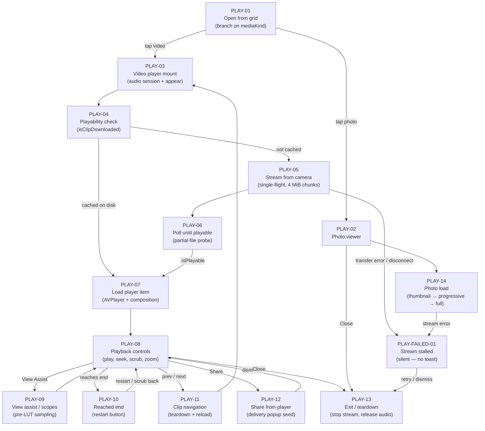

# Flow: Media Playback — video player & photo viewer

What happens after a clip is tapped in the browser grid: the split into video vs photo, streaming
a not-yet-cached clip while it plays, the AVPlayer transport, live scopes during playback, share,
and teardown. Grid/listing/selection live in [media-browsing.md](./media-browsing.md); this flow
starts at the tap (MEDIA-10 / MEDIA-11 there map to PLAY-03 / PLAY-02 here).

## Node cards

### PLAY-01 — Open from grid

- **Status:** shipped
- **Screen:** Tapping a grid cell opens a `fullScreenCover`; the branch is by `clip.mediaKind`
  (photo vs video, derived from the filename).
- **Code:** `MediaBrowser.swift` `open(_:)`; `playingClip`/`viewingPhoto` state driving the covers;
  `MediaLibrary.swift` `MediaClip.mediaKind`, `MediaClipFilename.isPhoto` / `isPlayableProxy`.
- **Detail:** The player receives the full `displayedClips` list (already tab/search/favorite
  filtered) so prev/next works, plus an optional `initialShareDestination` when resuming from a
  Frame.io hop.
- 📝 Notes:

### PLAY-02 — Photo viewer

- **Status:** shipped
- **Screen:** Full-screen `MediaPhotoViewer`; pinch-zoom 1–4× in a ScrollView, snaps back below
  1.05×, pan when zoomed. Close returns to the grid.
- **Code:** `MediaBrowser.swift` `MediaPhotoViewer`.
- 📝 Notes:

### PLAY-03 — Video player mount

- **Status:** shipped
- **Screen:** `MediaPlayerView` full-screen. On appear it activates the playback `AVAudioSession`
  (`.playback`/`.moviePlayback`, so audio ignores the mute switch like other media apps) and calls
  `loadActiveClip()`.
- **Code:** `MediaBrowser.swift` `MediaPlayerView.appear()` / `loadActiveClip()`;
  `PlaybackAssists.swift` `MediaPlaybackAudioSession.activateForPlayback()`.
- 📝 Notes:

### PLAY-04 — Playability check

- **Status:** shipped
- **Detail:** `isClipDownloaded(clip)` = file exists on disk AND its size ≥ `clip.sizeBytes`.
  Cached ⇒ straight to PLAY-07; not cached ⇒ start streaming (PLAY-05) and poll (PLAY-06)
  concurrently.
- **Code:** `NativeAppRoot.swift` `isClipDownloaded`; `MediaPlayerView.loadActiveClip`.
- 📝 Notes:

### PLAY-05 — Stream from camera

- **Status:** shipped
- **Detail:** `streamClip(_:)` runs on a background Task behind a global single-flight lock (one
  transfer per clip even if the viewer and a delivery pre-pass both ask). Opens the local file for
  append (resumable from `startOffset`), loops `getPartialObject` in 4 MiB chunks, writes each and
  updates `mediaDownloadProgress[clipID]` (feeds the scrubber's buffered bar). On error it deletes
  the partial file and clears progress. Requires a connected session + a PTP object handle.
- **Code:** `NativeAppRoot.swift` `startClipStream`, `streamClip`, `cancelClipStream`,
  `clipBufferedFraction`, `mediaDownloadProgress`.
- 📝 Notes:

### PLAY-06 — Poll until playable

- **Status:** shipped
- **Detail:** Runs alongside PLAY-05 — does NOT wait for 100%. Probes the growing file with
  `AVURLAsset.load(.isPlayable)` every 400 ms; on first success sets ready and loads the player item
  immediately, so playback can begin mid-download once AVFoundation sees a valid MOV/MP4 structure.
- **Code:** `MediaBrowser.swift` `MediaPlayerView.pollUntilPlayable`.
- 📝 Notes:

### PLAY-07 — Load player item

- **Status:** shipped
- **Detail:** Builds `AVURLAsset` → `AVPlayerItem` → `player.replaceCurrentItem`, attaches the
  playback video composition (`attachPlaybackVideoComposition`), registers the end-of-clip observer
  (PLAY-10) and a 0.2 s periodic time observer (scrubber position, suppressed while scrubbing), then
  auto-plays. The composition applies LUT / log / false-colour and, critically, exposes the
  **pre-LUT source frame** to the scope sampler (PLAY-09) so waveform/histogram match live view.
- **Code:** `MediaBrowser.swift` `loadPlayerItem`, `attachPlaybackVideoComposition`,
  `observePlaybackEnd`; `MediaLUT.PlaybackEffectsBox`.
- 📝 Notes:

### PLAY-08 — Playback controls

- **Status:** shipped
- **Screen:** Tap centre = play/pause (with a ~0.9 s flash icon); ±15 s buttons; draggable scrubber
  (throttled 75 ms seeks, buffered-progress underlay); long-press-then-drag frame scrub with a
  centre time overlay; mute; pinch-zoom 1–4× + pan; vertical swipe toggles the chrome bars. Prev/next
  arrows only when `clips.count > 1`.
- **Code:** `MediaBrowser.swift` transport bar + gesture handlers (`MediaPlayerView`).
- 📝 Notes:

### PLAY-09 — View assist / scopes

- **Status:** shipped
- **Screen:** View-Assist toggle swaps the transport for a scrolling assist toolbar (waveform,
  parade, histogram, traffic lights); long-press a tool for its options popup.
- **Detail:** `PlaybackScopeController` polls `PlaybackEffectsBox.readScopeSamples()` every 84 ms.
  Samples are read inside the composition handler (pre-LUT), NOT from `AVPlayerItemVideoOutput`
  (which would be post-grade). Effects update live via `set(effects:)` without replacing the item.
- **Code:** `PlaybackAssists.swift` `PlaybackScopeController`; `MediaBrowser.swift`
  `PlaybackAssistOverlayModule`, `resolvedPlaybackEffects`.
- 📝 Notes: Fixed 84 ms poll runs even while paused — wasted cycles; could gate on `isPlaying`.

### PLAY-10 — Reached end

- **Status:** shipped
- **Detail:** `AVPlayerItemDidPlayToEndTime` sets `reachedEnd`, and the transport shows a restart
  button instead of play. Scrubbing back to < duration − 0.25 s clears the flag. No auto-loop.
- **Code:** `MediaBrowser.swift` `observePlaybackEnd`, seek/scrub handlers.
- 📝 Notes:

### PLAY-11 — Clip navigation

- **Status:** shipped
- **Detail:** Prev/next cancels the active stream, tears down the player, resets zoom/pan/scrub,
  animates a slide in the swipe direction, then re-enters the PLAY-03 load cycle for the adjacent
  clip. Task-based, so rapid prev/next mashing is safe (prior transfer cancelled).
- **Code:** `MediaBrowser.swift` `goToAdjacentClip`.
- 📝 Notes:

### PLAY-12 — Share from player

- **Status:** shipped
- **Detail:** Pauses if playing, anchors the delivery popup to the share button, seeds it with the
  current clip (and a pre-selected Frame.io destination when resuming a hop). Resumes playback on
  dismiss if it was playing. Share is disabled until the clip is fully downloaded. Full delivery flow
  in [media-delivery-frameio.md](./media-delivery-frameio.md).
- **Code:** `MediaBrowser.swift` share button + `MediaDeliveryPopupOverlay`, `initialShareDestination`.
- 📝 Notes:

### PLAY-13 — Exit / teardown

- **Status:** shipped
- **Detail:** `disappear()` cancels the stream poll + flash task, calls `cancelClipStream()`, then
  `teardownPlayer()` (stop scope controller, remove time + end observers, clear the composition,
  cancel asset loading, pause + clear the item) and `deactivateAfterPlayback()` to release the audio
  session. App-backgrounding runs the same path; partial bytes stay on disk and resume from
  `startOffset` on re-open if still connected.
- **Code:** `MediaBrowser.swift` `disappear`, `teardownPlayer`;
  `PlaybackAssists.swift` `MediaPlaybackAudioSession.deactivateAfterPlayback`.
- 📝 Notes:

### PLAY-14 — Photo load

- **Status:** shipped
- **Detail:** Shows the thumbnail first, then either loads full-res from disk (if downloaded) or
  starts a stream and polls every 400 ms, displaying the partial file progressively as it grows. No
  playability gate — the image just sharpens as bytes arrive.
- **Code:** `MediaBrowser.swift` `MediaPhotoViewer.loadImage`.
- 📝 Notes:

### PLAY-FAILED-01 — Stream stalled

- **Status:** needs-work
- **Detail:** If the camera disconnects (or PTP errors) mid-stream, `streamClip` fails its session
  guard, the download freezes at the last progress %, and playback halts wherever the cached bytes
  end. There is **no error toast** — the user just sees a stuck clip. Recovery is manual (reopen when
  reconnected; the partial file resumes). Candidate fix: surface a HUD toast on mid-stream failure.
- **Code:** `NativeAppRoot.swift` `streamClip` catch/guard; `MediaPlayerView` (no failure surface).
- 📝 Notes:
