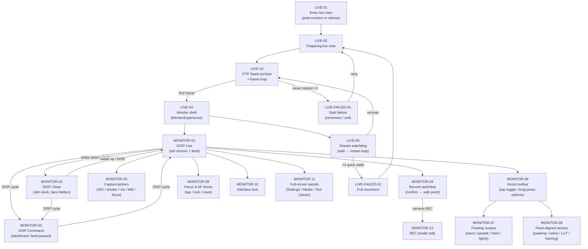

# Flow: Monitor — Live view, controls, scopes

Connected monitor session: PTP live-view activation through DISP modes, capture controls, assist
tools, scopes, and recording. Handoff from [camera-ap-join.md](./camera-ap-join.md) at LIVE-01.
Every box below has a node card with the detail; edit anything, Claude picks it up from the diff.

## Node cards

### LIVE-01 — Enter live view

- **Status:** shipped
- **Screen:** Startup ready card “Live view”, or automatic entry immediately after PTP connect
  (no landing page when connect succeeds).
- **Code:** `NativeAppRoot.enterLiveView()`, `StartupReadyLiveViewPolicy.canEnterMonitor`,
  `NativeAppRoot.swift` (post-connect block calls `enterLiveView()`).
- **Detail:** Requires `connection == .connected`, an active `NativeCameraSession`, and not busy
  (pairing / reconnecting / preparing). Demo mode skips PTP and sets `isMonitorPresented` directly.
- 📝 Notes:

### LIVE-02 — Preparing live view

- **Status:** shipped
- **Screen:** Connection progress or inline status: “Opening live view…”.
- **Code:** `NativeAppRoot.enterLiveView()` → `startLiveView(session:)`.
- **Detail:** Sets `connection = .preparingLiveView`, `connectionPhase = .preparingLiveView`, then
  launches the outer `liveViewTask` restart loop.
- 📝 Notes:

### LIVE-03 — PTP StartLiveView + frame loop

- **Status:** shipped
- **Screen:** “WAITING FOR LIVE VIEW” overlay on the feed until the first decoded bitmap arrives
  (`LiveFeedWaitingOverlay`).
- **Code:** `NativeCameraSession.configureLiveView`, `startLiveView()`, `liveViewFrame()`,
  `NativeAppRoot.streamUntilStall`, `LiveFrameProcessor.swift`, `FrameDecoder`.
- **Detail:** Configures image size/compression from operator prefs, sends PTP `StartLiveView`,
  polls `DeviceReady` (≤40 × 50 ms), then pulls JPEG frames one at a time. Decode and assist
  baking run off the main actor; display publishes `liveFrameImage` ~24–30 Hz. Default feed path
  is `LiveFrameView` (`UIImageView`); opt-in `ZC_METAL_FEED=1` uses `MetalLiveView` +
  `MetalFeedFrameBaker`. Scope sampling meters the **clean** decoded frame (never the
  assist-composited display).
- 📝 Notes:

### LIVE-04 — Monitor shell

- **Status:** shipped
- **Screen:** Full-screen `MonitorExperience` replaces `LinkExperience` when
  `isMonitorPresented == true`.
- **Code:** `MonitorExperience.swift` (`LiveViewShell`), `NativeAppRoot.swift` (`isMonitorPresented`),
  `Sources/OpenZCineCore/MonitorLayoutPolicy.swift`.
- **Detail:** First good frame sets `isMonitorPresented = true`, dismisses connection progress,
  resets stall counters, publishes timecode/FPS/batteries. Layout resolves feed safe area, 16:9
  full-bleed frame, mirrored chrome for landscape-right (`MonitorHorizontalLayoutDirection`), and
  module positions via `MonitorLiveViewModuleLayout.fit`.
- 📝 Notes:

### LIVE-FAILED-01 — Start failure

- **Status:** shipped
- **Detail:** `.neverStarted` outcome (unreadable first frame, StartLiveView rejected, etc.):
  exponential backoff (1 s → 8 s cap), then **full reconnect** via `connectToCamera()` — a wedged
  command channel needs a fresh socket, not an in-session retry. After 3 consecutive never-started
  attempts, gives up (`isMonitorPresented = false`, operator falls back to startup ready). Status
  shows `liveFPS = "RECOV"` / `"LINK"` while recovering.
- **Code:** `streamUntilStall` catch path, `startLiveView` outer loop.
- 📝 Notes:

### LIVE-05 — Stream watchdog

- **Status:** shipped
- **Detail:** `LiveViewWatchdog` declares stall on no good frame within the timeout window or a
  streak of unparsable JPEGs. Outer loop backs off and re-enters LIVE-03; healthy runs (>30 s)
  reset the stall counter. Command mode pauses frame pulls (250 ms safe-point cadence) — watchdog
  idle while dashboard is up.
- **Code:** `streamUntilStall`, `LiveViewWatchdog`, `startLiveView` restart loop.
- 📝 Notes:

### LIVE-FAILED-02 — Full reconnect

- **Status:** shipped
- **Detail:** Three quick back-to-back stalls escalate from stream restart to
  `connectToCamera()` — tears down the session and re-establishes from the saved profile.
- **Code:** `startLiveView` `.stalled` branch (`stallAttempt >= maxStallRestarts`).
- 📝 Notes:

### MONITOR-01 — DISP Live (full chrome)

- **Status:** shipped
- **Screen:** 16:9 feed, top status deck (REC chip, timecode, resolution, codec, media, FPS),
  bottom assist toolbar + capture-settings bar, side rails (lock, batteries, settings/media/record/DISP).
- **Code:** `MonitorExperience.swift` (`LiveViewChromeLayer`, `MonitorRailsLayer`,
  `TopInfoDeckModule`, `BottomAssistToolsModule`, `BottomCaptureSettingsModule`).
- **Detail:** Default `displayMode == .live`. AF/focus boxes drawn over the feed
  (`LiveFocusBoxOverlay`). Recording state from `cameraState.recordState` (also driven by camera
  events `0xC10A` / `0xC108`). Vertical swipe on feed: down → clean, up → live.
- 📝 Notes:

### MONITOR-02 — DISP Clean

- **Status:** shipped
- **Screen:** Full feed with slim top deck (REC + timecode + FPS only); full deck and bottom bars
  slide off-screen; side rails stay fixed. Framing guides + de-squeeze remain; grid / crosshair /
  level hidden (`FeedAlignedAssists(clean: true)`).
- **Code:** `LiveViewChromeLayer` (`isClean` animations), `DispMode.clean` in
  `Sources/OpenZCineCore/CameraDisplayState.swift`.
- **Detail:** Chrome layout reserves bottom-bar height even while bars are visually hidden so rails
  never shift during the transition.
- 📝 Notes:

### MONITOR-03 — DISP Command

- **Status:** shipped
- **Screen:** Full-screen black base + command dashboard (hero timecode, health strip, reorderable
  3×3 control grid, Image/Focus/Audio side column). Feed hidden; stream loop idles at safe points.
- **Code:** `MonitorPanels.swift` (`CommandMonitor`, `CommandPrimaryGrid`),
  `streamUntilStall` command-mode branch.
- **Detail:** Side rails (record, DISP, settings, media) remain in the same positions as live/clean.
  Property polls run every 250 ms instead of every 8 frames.
- 📝 Notes:

### MONITOR-04 — Record start/stop

- **Status:** shipped
- **Screen:** Right-rail record button (circle → rounded square while REC). Optional confirmation
  alert when `recordConfirmationEnabled`. Heavy haptic on toggle.
- **Code:** `RightRailControlsModule.recordButton`, `NativeAppRoot.toggleRecording`,
  `confirmRecordToggle`, `executeRecordToggle`, `runControlSafePoint` record branch,
  `NativeCameraSession.startRecording` / `stopRecording` (PTP `StartMovieRecInCard` / `EndMovieRec`).
- **Detail:** Optimistic UI flip immediately; actual PTP op queued to the next live-view safe point
  (after focus point, before property writes) so it never races `GetLiveViewImageEx`. Reverts on
  camera rejection. Requires live view active (`isMonitorPresented`).
- 📝 Notes:

### MONITOR-12 — REC border tally

- **Status:** shipped
- **Screen:** Red stroke border on the physical-screen layer (bezel to bezel), shadow glow.
- **Code:** `RecordingBorderModule` in `MonitorExperience.swift`.
- **Detail:** Shown when `cameraState.recordState == .recording` (camera-authoritative, including
  body-side record start).
- 📝 Notes:

### MONITOR-05 — Capture pickers

- **Status:** shipped
- **Screen:** Bottom capture bar: ISO, SHUTTER, IRIS, FOCUS, WB readouts. Tap opens drum picker
  rising from the bar; top-deck resolution/codec open downward. Active readout highlighted gold.
  Shutter long-press locks/unlocks camera TV control (`MovieTVLockSetting`).
- **Code:** `CaptureSettingButton`, `MonitorPanels.swift` (`PickerPanel`, `PanelHost`),
  `NativeAppRoot.showPicker`, `switchPicker`, `handleBackdropTap`, property write queue +
  `performNextPendingCameraWrite`.
- **Detail:** Writes queued for live-view safe points (same gate as record). ISO locked while
  recording in R3D NE (`ISOPickerPolicy`). Dual-base ISO tabs for R3D NE only. Interface lock
  blocks all picker opens.
- 📝 Notes:

### MONITOR-06 — Assist toolbar

- **Status:** shipped
- **Screen:** Horizontally scrollable bottom-left bar: LUT, PEAK, FALSE, ZEBRA, WAVE, PARADE,
  HISTO, LIGHTS, GUIDES, GRID, CROSS, LEVEL, DE-SQ (operator-reorderable in Settings). Tap
  toggles; long-press opens options drawer when `hasConfiguration`.
- **Code:** `BottomAssistToolsModule`, `AssistToolButtonRow`, `NativeAppRoot.toggleAssist`,
  `presentAssistOptions`, `Sources/OpenZCineCore/OperatorPreferences.swift` (`MonitorAssistTool`).
- **Detail:** Visibility persisted per context (live vs playback). Groups of three separated by
  vertical dividers. Scroll edge chevrons on iOS 18+.
- 📝 Notes:

### MONITOR-07 — Floating scopes

- **Status:** shipped
- **Screen:** Draggable floating panels outside the feed: resizable waveform, RGB parade, histogram,
  and traffic lights; a compact 264 × 52 pt false-colour **reference strip** (movable, fixed-size,
  and not the feed tint). Default positions anchor just outside feed edges (`MovablePanel`).
- **Code:** `MonitorOverlays.swift` (`FeedAssistOverlayModule`, `LiveWaveformScopePanel`,
  `ScopeMini`, `TrafficLightsMeterMini`, `FalseColorReference`), `GPUScopeSampler.swift`,
  `LiveFrameProcessor.refreshScopes`, `ScopeAssistSampling`.
- **Detail:** CPU path: `ScopeSampler` downsamples clean frame → bins/points at thermally throttled
  intervals. Opt-in `ZC_GPU_SCOPES=1`: GPU atomic histogram (`GPUScopeSampler`); waveform/parade
  scatter from `scopeScatterFrame` via Metal (`ScopeScatterView`). Traffic lights derived from
  shared sample bundle. Panels persist drag position in `movablePanelCenters`.
  The reference key places IRE and Limits zones proportionally on the full 0–100 ruler with
  progressively lighter neutral-grey gaps; ZC Stops places sparse reference landmarks on its
  scene-stop ruler through the camera-aware maximum.
- 📝 Notes:

### MONITOR-08 — Feed-aligned assists

- **Status:** shipped
- **Screen:** Overlays registered pixel-exact on the feed: aspect guides, grid, crosshair, horizon
  level; peaking, zebra, false-colour tint, LUT, and de-squeeze applied in the feed render path.
- **Code:** `FeedAlignedAssists` (`MonitorOverlays.swift`), `LiveFrameFeedLayer` /
  `MetalLiveView` + `LiveImageEffects` (`LiveFrameProcessor.swift`, `FalseColorMap`, `MonitorLUT`),
  `MetalFeedFrameBaker.swift`.
- **Detail:** Framing aids drawn in SwiftUI on the feed rect; exposure assists baked via Core Image
  (UIImageView path) or GPU (Metal path). ZC Stops uses scene-linear landmarks at minimum, −3, 18%
  grey, skin, +2, and three camera-relative maximum warnings, leaving other tones greyscale. IRE
  uses RED Video Mode-style categories after Log3G10/N-Log-aware display mapping.
  De-squeeze scales the raster and bounds guide overlays.
  Level reads camera PTP horizon (`AngleLevelYawing` / `AngleLevelPitching`) with CoreMotion
  fallback.
- 📝 Notes:

### MONITOR-09 — Focus & AF boxes

- **Status:** shipped
- **Screen:** White AF box (box 0), green face/eye boxes (1+). Tap feed to move focus; 0.3 s
  long-press locks focus point (accent outline + lock badge). Recenter button when off-centre.
- **Code:** `LiveFeedModule` gestures, `LiveFocusBoxOverlay`, `NativeAppRoot.setFocusPoint`,
  `toggleFocusPointLock`, `resetFocusPoint`, `session.changeAfArea` at safe point.
- **Detail:** Focus commands queued to safe point like record. Lock is app-only (visual); camera
  still drives AF boxes from live-view header metadata.
- 📝 Notes:

### MONITOR-10 — Interface lock

- **Status:** shipped
- **Screen:** Top-leading lock button; when locked, bottom bars dim to 40 % opacity, DISP/assist/
  picker interactions blocked.
- **Code:** `LockButtonModule`, `NativeAppRoot.toggleInterfaceLock`, guards on
  `cycleDisplayMode`, `showPicker`, `toggleAssist`, etc.
- **Detail:** Side-rail settings/media/record remain reachable (record still works). Focus lock
  gesture independent of interface lock.
- 📝 Notes:

### MONITOR-11 — Full-screen panels

- **Status:** shipped
- **Screen:** Operator Setup, Media browser, Tool Library — edge-to-edge over the monitor; chrome
  rails hidden while open. Floating picker/assist popups keep rails visible.
- **Code:** `PanelHost`, `OperatorSettingsPanel`, `MediaBrowserView`, `AssistLibraryPanel`,
  `NativeAppModel.ActivePanel.coversFullScreen`.
- **Detail:** Full-screen panels render on the physical-screen layer (bezel-to-bezel), clearing
  Dynamic Island on the occupied side only. Backdrop tap on floating panels blends/dismisses via
  `handleBackdropTap`.
- 📝 Notes:
