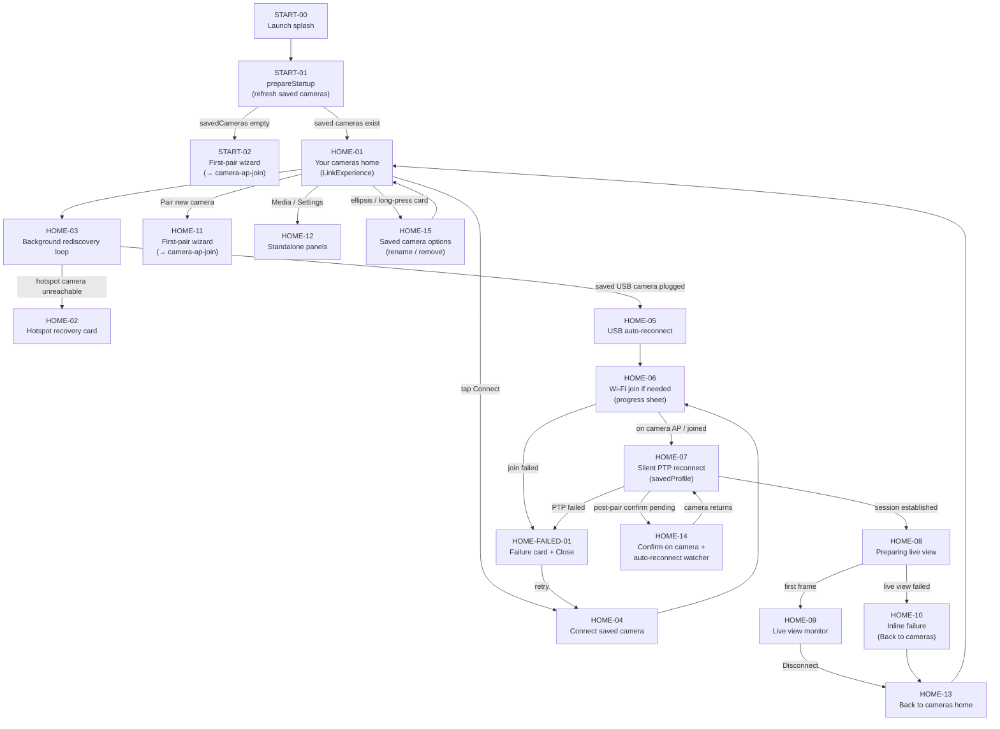

# Flow: Startup Home — post-first-pair home, reconnect, link experience

The returning-operator journey after at least one camera is saved: launch → saved-camera home →
manual or automatic reconnect → live view. First-pair wizard steps live in
[camera-ap-join.md](./camera-ap-join.md) — this flow only references that path at the branch
points where code routes there.

## Node cards

### START-00 — Launch splash

- **Status:** shipped
- **Screen:** Branded splash overlay on cold launch; fades out after `LaunchSplashTiming`.
- **Code:** `NativeAppRoot.swift` (`LaunchSplashOverlay`, `showsLaunchSplash`).
- **Detail:** Underneath, `LinkExperience` mounts immediately; splash is visual only.
- 📝 Notes:

### START-01 — prepareStartup

- **Status:** shipped
- **Screen:** No dedicated screen — runs on `LinkExperience.onAppear`.
- **Code:** `LinkExperience.swift` (`onAppear`), `NativeAppModel.prepareStartup()`.
- **Detail:** One-shot: phone battery monitoring, `refreshSavedCameras()`, `applyStartupDestination()`
  (`CameraStartupPolicy.launchDestination`), optional first-pair wizard entry config, Wi‑Fi SSID cache
  refresh. Starts the background discovery loop when saved cameras exist (or wizard is already on
  discover-and-pair). First launch with an empty store skips the loop until the wizard reaches
  pairing.
- 📝 Notes:

### START-02 — First-pair wizard (no saved cameras)

- **Status:** shipped
- **Screen:** Full-viewport `StartupFirstPairWizardView` — header "Connection setup".
- **Code:** `LinkExperience.swift` (`shouldShowFirstPairWizard`), `StartupDesign.swift`.
- **Detail:** `shouldShowFirstPairWizard` is true when `savedCameras.isEmpty` **or**
  `isPairingNewCamera`. Routes to [camera-ap-join.md](./camera-ap-join.md) — not expanded here.
- 📝 Notes:

### HOME-01 — Your cameras home

- **Status:** shipped
- **Screen:** Header "Your cameras"; two-column landscape layout — intro card ("Your cameras.",
  Pair new camera, Media library, Settings) + scrollable camera list ("Tap a camera to connect").
- **Code:** `LinkExperience.swift`, `StartupDesign.swift` (`StartupSavedCamerasView`,
  `StartupHeader`).
- **Detail:** Shown when `!shouldShowFirstPairWizard && !isConnected`. `startupMode` is
  `.savedCameras`. Status pill in header reflects discovery (`Looking` / `Ready`). Actions lock
  while `connection` is `.pairing`, `.reconnecting`, or `.preparingLiveView`.
- 📝 Notes:

### HOME-02 — Hotspot recovery card

- **Status:** shipped
- **Screen:** Accent-bordered card above the camera list: "iPhone Hotspot needed" or "iPhone
  Hotspot active", with step pills and instructions.
- **Code:** `StartupDesign.swift` (`StartupHotspotRecoveryCard`), core
  `CameraStartupPolicy.recoveryPrompt`.
- **Detail:** Appears when a saved camera last used Personal Hotspot, no saved camera is currently
  reachable, and discovery confirms none online. Two variants: prompt to enable hotspot, or wait
  while bridge is active (`NativePersonalHotspotDetector`). Affected row shows "Waiting for
  hotspot" + Reconnect outline button.
- 📝 Notes:

### HOME-03 — Background rediscovery loop

- **Status:** shipped
- **Screen:** No modal — status pill "Looking" and row pills update in place (Online / Offline /
  Connected).
- **Code:** `NativeAppRoot.swift` (`runDiscoveryLoop`, `applyDiscoveryResults`),
  `NativeCameraDiscovery.swift`, core `SavedCameraAvailabilityPolicy`.
- **Detail:** Bonjour + subnet probe on a loop; empty scans back off 0.85s → 4s cap. Resolves each
  saved row via host/name match. Updates `connectionMessage` for recovery copy when hotspot-related.
  Does **not** auto-connect Wi‑Fi saved cameras — operator must tap Connect (USB is the exception,
  HOME-05).
- 📝 Notes:

### HOME-04 — Connect saved camera

- **Status:** shipped
- **Screen:** Row Connect button (filled when Online/Connected, outline when offline/recovery).
- **Code:** `StartupDesign.swift` (`StartupCameraListRow.connect()`),
  `NativeAppModel.connectSavedCamera` / `connectToCamera`.
- **Detail:** `.available(discovered)` passes the live `DiscoveredCamera`; `.offline` connects by
  saved host only. Long-press / ⋯ menu: Rename, Remove (`forgetPairing`). Single-flights
  `connectToCamera` — impatient re-taps coalesce.
- 📝 Notes:

### HOME-05 — USB auto-reconnect

- **Status:** shipped
- **Screen:** Inline status copy on the home screen ("Camera detected on USB-C. Reconnecting…") while
  the progress sheet runs.
- **Code:** `NativeAppRoot.applyDiscoveryResults` (USB branch),
  `CameraStartupPolicy.savedCamera(forDiscovered:)`.
- **Detail:** When `startupMode == .savedCameras`, a plugged-in saved USB body triggers
  `connectToCamera` once per plug-in (`attemptedUSBAutoReconnectHostKeys` re-arms on unplug). No
  operator tap required.
- 📝 Notes:

### HOME-06 — Wi-Fi join if needed

- **Status:** shipped
- **Screen:** White `ConnectionProgressSheet` card — phase `joiningWiFi`: "Connecting…" / "Tap Join
  when iOS asks to switch networks."
- **Code:** `ConnectionProgressSheet.swift`, `NativeAppRoot.performWiFiJoinIfNeeded`,
  `WiFiJoinCoordinator.swift`, core `CameraWiFiJoinPolicy.joinTargetIfNeeded`.
- **Detail:** Runs inside `connectToCamera` when the phone is off the camera AP subnet and the saved
  record resolves an SSID (keychain password). Skipped when already on the camera AP, transport is
  USB, **or the camera is on the iPhone's Personal Hotspot** — there the phone HOSTS and the camera
  joins, so there's no phone-side join (fixed 2026-07-05: `joinTargetIfNeeded` now returns nil for a
  hotspot camera, identified by a hotspot transport label or a `172.20.10.x` host, via
  `CameraStartupPolicy.usesIPhoneHotspot`; previously it wrongly showed "Tap Join when iOS asks…" and
  could attempt a spurious join). Uses `NEHotspotConfiguration` with the same transparent retry
  behavior as first-pair join. Also used when `endInternetHop()` rejoins after a RED LUT download.
- 📝 Notes:

### HOME-07 — Silent PTP reconnect

- **Status:** shipped
- **Screen:** Progress sheet phases `handshaking` → `connected` (spinner rows).
- **Code:** `NativeAppRoot.establishStartupSession`, core `CameraStartupPolicy.connectionStrategy`
  (`.savedProfile`), `ConnectionProgress.swift`.
- **Detail:** Saved host → `requestPairing: false` silent reconnect. Stale saved profile falls back
  to first-time pairing (`forgetKnownPairing` + handshake). On success: upsert saved camera,
  `markFirstPairWizardCompleted`, then `enterLiveView()`. Progress sheet stays up until first live
  frame or failure.
- 📝 Notes:

### HOME-FAILED-01 — Failure card

- **Status:** shipped
- **Screen:** White card phase `failed` — pinned `connectionFailureDetail` (discovery loop must not
  overwrite failure copy). Close / Cancel returns to home; discovery restarts.
- **Code:** `ConnectionProgressSheet.swift`, `NativeAppRoot.cancelConnectionAttempt`,
  `surfaceCameraWiFiJoinFailure`.
- **Detail:** Wi‑Fi join errors, discovery timeout after join, PTP handshake failures, and rejected
  initiator all land here. Cancel also disarms `pendingPairedReconnectHost` so background reconnect
  does not race a dismissed attempt.
- 📝 Notes:

### HOME-08 — Preparing live view

- **Status:** shipped
- **Screen:** Brief inline `StartupPreparingLiveView` under the progress sheet ("Starting live
  view…") when `connection == .connected` before the stream starts; progress sheet shows
  `preparingLiveView` phase.
- **Code:** `StartupDesign.swift` (`StartupPreparingLiveView`), `NativeAppModel.enterLiveView`,
  `startLiveView`.
- **Detail:** Skips the old full-screen "Camera ready" landing — drives straight into the monitor.
  `enterLiveView` sets `connection = .preparingLiveView` (home actions lock). First decoded frame
  sets `isMonitorPresented = true` and dismisses the sheet.
- 📝 Notes:

### HOME-09 — Live view monitor

- **Status:** shipped
- **Screen:** Full-screen `MonitorExperience` replaces `LinkExperience`.
- **Code:** `NativeAppRoot.swift` (`isMonitorPresented`, `streamUntilStall` first-frame path).
- **Detail:** Live-view watchdog handles stall recovery (stream restart, then full reconnect after
  repeated failures). Disconnect from monitor menu or startup "Back to cameras" returns to HOME-13.
- 📝 Notes:

### HOME-10 — Inline live-view failure

- **Status:** shipped
- **Screen:** `StartupPreparingLiveView` with error copy + **Back to cameras** outline button (always
  visible — including when a session exists but live view never started).
- **Code:** `StartupDesign.swift` (`StartupPreparingLiveView`), `startLiveView` `.neverStarted` /
  stall-escalate paths.
- **Detail:** After max stall/never-started retries, `isMonitorPresented` stays false and the
  operator can `disconnect()` back to the list. Background reconnect may also re-trigger
  `connectToCamera` with "Live view didn't start — reconnecting…" copy.
- 📝 Notes:

### HOME-11 — Pair new camera

- **Status:** shipped
- **Screen:** Wizard replaces home — same surface as START-02.
- **Code:** `NativeAppModel.startFirstPairWizard()`, intro card button in
  `StartupSavedCamerasView`.
- **Detail:** Stops discovery, sets `isPairingNewCamera = true`, resets wizard to permissions
  (or transport if permissions already granted). Completing pair saves the camera and returns to
  saved-camera mode. See [camera-ap-join.md](./camera-ap-join.md).
- 📝 Notes:

### HOME-12 — Standalone Media / Settings

- **Status:** shipped
- **Screen:** Full-screen Media browser or Operator Setup — no camera session required.
- **Code:** `StartupDesign.swift` (`StartupMediaLibraryButton`), `NativeAppRoot.swift`
  (`isStandaloneMediaLibraryPresented`, `isStandaloneSettingsPresented`, root `fullScreenCover`s).
- **Detail:** Frame.io sign-in and media cache management available before a shoot. Does not start
  discovery or connection.
- 📝 Notes:

### HOME-13 — Back to cameras home

- **Status:** shipped
- **Screen:** Returns to HOME-01 layout; monitor and session torn down.
- **Code:** `NativeAppModel.disconnect()`, `StartupPreparingLiveView` Back button,
  monitor disconnect affordances.
- **Detail:** Clears session, resets connection to `.disconnected`, restarts discovery loop
  (`resetResults: false`) so row availability refreshes.
- 📝 Notes:

### HOME-14 — Confirm on camera + auto-reconnect watcher

- **Status:** shipped
- **Screen:** Progress sheet phase `confirmOnCamera` after in-app pairing completes; home discovery
  continues underneath with status copy.
- **Code:** `NativeAppRoot.transitionToSavedCameraNetworkCheck`, `applyDiscoveryResults`
  (`pendingPairedReconnectHost`), `attemptPairedReconnectRejoin`.
- **Detail:** Relevant when adding a camera from HOME-11 or when a saved profile re-pairs. Waits for
  the camera to drop off the network after body confirmation, throttled Wi‑Fi re-apply (5s), then
  silent reconnect on rediscovery. Stays armed through flaky Init timeouts until success or Cancel.
  Overlaps RECON-01 in [camera-ap-join.md](./camera-ap-join.md) — same mechanism, entered from home
  after "Pair new camera."
- 📝 Notes:

### HOME-15 — Saved camera options (rename / remove)

- **Status:** shipped
- **Screen:** Each saved-camera card exposes Rename and Remove twice: an ellipsis `Menu` button
  and a long-press `.contextMenu` (same `menuActions`). Rename opens an alert with a TextField;
  Remove opens a destructive confirm alert.
- **Code:** `StartupDesign.swift` saved-camera card (`optionsMenu`, `menuActions`,
  `commitRename`), `NativeAppModel.updateSavedCameraPresentation`, `forgetPairing(host:)`.
- **Detail:** Rename persists via `updateSavedCameraPresentation` (empty string clears back to
  the camera-provided name); Remove calls `forgetPairing(host:)` after confirmation. Known
  wart: first-ever open of the menu in a session pays UIKit menu warm-up (noticeable delay),
  and benign console noise appears (`updateVisibleMenuWithBlock` from menu re-evaluation while
  closed, keyboard frame notifications from the alert TextField session).
- 📝 Notes:
